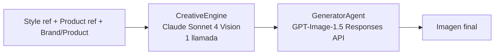
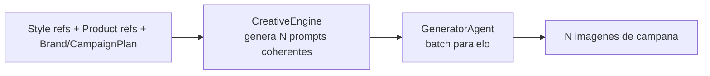
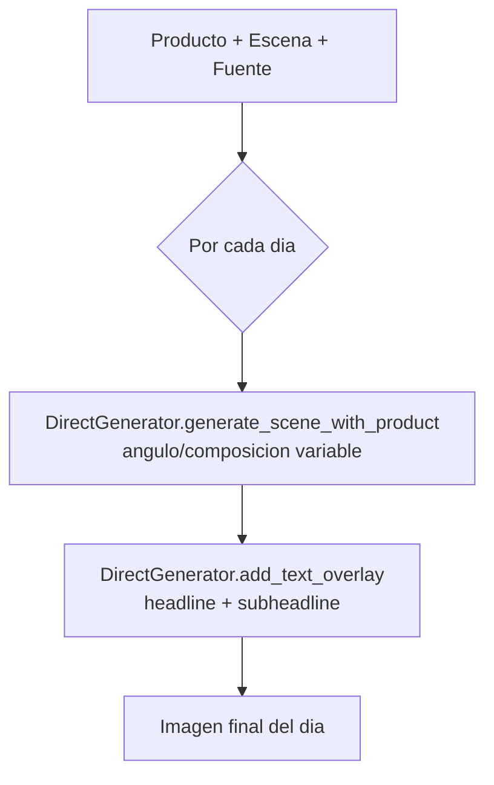

# CM-Agents: Documentación para Agentes AI

Este documento describe el sistema de orquestación de agentes para que otro agente AI pueda entenderlo, modificarlo o extenderlo.

## Propósito del Sistema

CM-Agents genera imágenes de productos para redes sociales (Instagram) automatizando el trabajo de un diseñador gráfico. Soporta **múltiples marcas** con identidades visuales independientes y **campañas publicitarias**.

Características principales:
- El producto real (réplica exacta)
- Texto integrado (nombre + headline)
- Logo de la marca insertado automáticamente
- Estilo visual de la referencia
- Consistencia de marca (colores, estilos preferidos)
- Campañas con temas y fechas

## Arquitectura: Pipelines de Agentes

### Generación individual (`cm generate`)



### Campañas batch (`cm campaign-inpaint`)



### Campaña por referencias (`cm campaign-refs`)



### Flujo de Datos

```
Input:
  - style_ref: Path (imagen Pinterest o referencia visual)
  - product_ref: Path (foto producto real)
  - brand: Brand (config marca)
  - product: Product (config producto)

CreativeEngine Output → Generator Input:
  - GenerationPrompt
    - prompt: str (prompt optimizado en inglés)
    - visual_description: str
    - negative_prompt: str
    - params: GenerationParams

Generator Output:
  - GenerationResult
    - image_path: Path
    - cost_usd: float
    - id, brand_name, product_name, variant_number
```

## Archivos Clave

### Agentes (`src/cm_agents/agents/`)

| Archivo | Clase | Modelo AI | Función |
|---------|-------|-----------|---------|
| `creative_engine.py` | `CreativeEngine` | Claude Sonnet 4 (Vision) | Analiza referencias y genera prompts en 1 llamada |
| `generator.py` | `GeneratorAgent` | GPT-Image-1.5 | Genera imagen final con Responses API |
| `strategist.py` | `StrategistAgent` | Claude Sonnet 4 | Interpreta lenguaje natural, crea planes de contenido |
| `base.py` | `BaseAgent` | N/A | Clase base abstracta para agentes |

### Servicios (`src/cm_agents/services/`)

| Archivo | Clase/Función | Uso |
|---------|---------------|-----|
| `direct_generator.py` | `DirectGenerator` | Generación escena+producto y text overlay (campaign-refs) |
| `inpainting_compositor.py` | `InpaintingCompositor` | Composición por inpainting (campaign-inpaint) |
| `variant_generator.py` | `VariantStrategy` | Genera variaciones de prompts |
| `mcp_client.py` | `MCPClientService` | Búsqueda en Pinterest vía MCP |

### Modelos (`src/cm_agents/models/`)

| Archivo | Clases | Uso |
|---------|--------|-----|
| `generation.py` | `ReferenceAnalysis`, `GenerationPrompt`, `GenerationResult` | Datos entre agentes |
| `brand.py` | `Brand`, `BrandIdentity`, `BrandAssets`, `StyleConfig`, `ColorPalette` | Configuración completa de marca |
| `product.py` | `Product` | Configuración de producto |
| `campaign.py` | `Campaign`, `CampaignTheme`, `ContentItem` | Campañas publicitarias |
| `campaign_plan.py` | `CampaignPlan`, `DayPlan`, `VisualCoherence` | Plan de campaña por días |
| `campaign_style.py` | `CampaignStyleGuide`, `PriceBadgeStyle` | Guía de estilo para campañas |
| `plan.py` | `ContentPlan`, `ContentPlanItem`, `ContentIntent` | Planes de contenido (Strategist) |

### Orquestación (`src/cm_agents/`)

| Archivo | Clase/Función | Uso |
|---------|---------------|-----|
| `pipeline.py` | `GenerationPipeline` | Orquesta CreativeEngine + Generator |
| `pipeline.py` | `CampaignPipeline` | Pipeline optimizado para campañas |
| `cli.py` | Typer commands | Interfaz CLI (`cm generate`, `cm campaign-refs`, etc.) |
| `styles.py` | `load_styles()`, `get_available_style_keys()` | Registro de estilos desde knowledge base |

### Knowledge Base (`knowledge/`)

| Archivo | Contenido |
|---------|-----------|
| `design_2026.json` | Estilos dinámicos, tendencias, guidelines por categoría |
| `copy_templates.json` | Templates de copy para diferentes objetivos |
| `industry_insights.json` | Insights por industria |
| `marketing_calendar.json` | Calendario de marketing (fechas clave) |

## Cómo Funciona Cada Agente

### 1. CreativeEngine

**Entrada**: Imágenes de referencia (estilo + producto), `Brand`, `Product`, `CampaignPlan` (opcional)
**Salida**: `GenerationPrompt` (uno o varios para campaña)

Fusiona la funcionalidad de análisis de referencias + construcción de prompts en **una sola llamada** a Claude Vision. Más eficiente y coherente que hacerlo en pasos separados.

**Métodos principales**:
- `create_single_prompt(style_reference, product_reference, brand, product, target_size, visual_direction)` — para generación individual
- `create_campaign_prompts(campaign_plan, style_references, product_references, brand, products)` — genera N prompts coherentes para una campaña

### 2. GeneratorAgent

**Entrada**: `GenerationPrompt`, imágenes de referencia, `Brand`, `Product`
**Salida**: `GenerationResult` (imagen guardada)

**Método principal**: `generate_with_image_refs(prompt, reference_images, ...)`
- Usa Responses API de OpenAI para mejor fidelidad
- Incluye imágenes de referencia como contexto
- Fallback a generación simple si Responses API no disponible

### 3. StrategistAgent

**Entrada**: Mensaje del usuario, `Brand` (opcional), contexto de conversación
**Salida**: Respuesta conversacional + `ContentPlan` (opcional)

Agente de nivel superior que interpreta lenguaje natural para planificación de contenido.

```python
class StrategistAgent:
    def chat(message, brand, context, images) -> (str, ContentPlan | None)
    def create_plan(prompt, brand, brand_dir) -> ContentPlan
```

**Responsabilidades**:
- Entender intención del usuario (`_analyze_intent`)
- Detectar objetivo: promocionar, lanzamiento, engagement
- Detectar ocasión: día del padre, navidad, black friday
- Auto-seleccionar estilo de diseño según marca/industria
- Crear queries para búsqueda de referencias en Pinterest (vía MCP)
- Generar `ContentPlan` con items ejecutables

## Pipeline de Orquestación

```python
# src/cm_agents/pipeline.py

class GenerationPipeline:
    def __init__(self, generator_model="gpt-image-1.5", design_style=None):
        self.engine = CreativeEngine()
        self.generator = GeneratorAgent(model=generator_model)
        self.design_style = design_style

    def run(self, reference_path, brand_dir, product_dir, ...):
        brand = Brand.load(brand_dir)
        product = Product.load(product_dir)

        # CreativeEngine: analiza refs + genera prompt (1 llamada Claude)
        prompt = self.engine.create_single_prompt(
            style_reference=reference_path,
            product_reference=product_ref,
            brand=brand, product=product,
            visual_direction=build_visual_direction_from_style(self.design_style),
        )

        # Generator: genera imagen (Responses API)
        result = self.generator.generate_with_image_refs(prompt, ref_images, ...)
        return results
```

### Campaña por referencias (reference-driven)

Flujo con **3 referencias**: producto, escena y fuente. Por cada día, se genera una base (escena+producto) con variación de ángulo/composición, y luego se agrega texto usando la referencia de tipografía.

- **DirectGenerator** (`services/direct_generator.py`):
  - `generate_scene_with_product(product_ref, scene_ref, angle_hint=...)`: una llamada a Responses API con ambas imágenes; prompt con "exact replica" del producto y un hint de ángulo.
  - `add_text_overlay(..., font_ref=Path)`: agrega headline/subheadline siguiendo la referencia de tipografía.
- **CampaignPipeline.run_reference_driven_campaign(...)**: genera N bases (una por día) + N finales (una por día). Por defecto 3 días: teaser, main_offer, last_chance.

## Knowledge Base: Sistema de Estilos Dinámico

Los estilos NO están hardcodeados. Se cargan de `knowledge/design_2026.json` via `src/cm_agents/styles.py`:

```python
from cm_agents.styles import get_available_style_keys, load_styles, build_visual_direction_from_style

get_available_style_keys()  # -> ["minimal_clean", "lifestyle_warm", ...]
load_styles()               # -> dict[str, StyleInfo]
build_visual_direction_from_style("minimal_clean")  # -> str con directivas visuales
```

Estructura del JSON:

```json
{
  "styles": {
    "minimal_clean": {
      "name": "Minimal Clean",
      "description": "...",
      "lighting": "soft_studio",
      "composition": "centered",
      "background": ["white", "light gray"],
      "prompt_template": "...",
      "negative_prompt": "..."
    }
  },
  "category_guidelines": {
    "food": {
      "recommended_styles": ["lifestyle_warm", "authentic_imperfect"],
      "lighting": ["natural_window", "golden_hour"],
      "props": ["ceramic dishes", "..."],
      "avoid": ["cold lighting", "..."]
    }
  }
}
```

**Para agregar un estilo**: Solo editar el JSON. El código lo carga automáticamente.

## CLI: Comandos Disponibles

```bash
# Generación
cm generate <producto> <marca> <ref_estilo> [-p <ref_producto>] [--style <estilo>] [--campaign <nombre>]

# Gestión de Marcas
cm brand-list                    # Lista marcas con industria y estilos preferidos
cm brand-create <nombre>         # Wizard interactivo para crear marca
cm brand-show <marca>            # Ver configuración completa

# Gestión de Campañas
cm campaign-create <marca> <nombre>   # Crear campaña con wizard
cm campaign-list <marca>              # Listar campañas
cm campaign-show <marca> <camp>       # Ver detalles y plan de contenido
cm campaign-inpaint <marca> <camp>    # Campaña con inpainting
cm campaign-refs <marca> -p <prod> -s <escena> -f <fuente> [--days 3]  # Campaña por referencias

# Planes de Contenido (Strategist)
cm plan-create <marca> <prompt>       # Crear plan desde lenguaje natural
cm plan-list                          # Listar planes
cm plan-show <plan_id>                # Ver detalles de un plan
cm plan-approve <plan_id>             # Aprobar plan para ejecución
cm plan-execute <plan_id>             # Ejecutar generación de un plan aprobado

# Herramientas
cm styles [categoria]            # Listar estilos de diseño
cm product-list <marca>          # Listar productos
cm status                        # Estado del sistema
cm estimate                      # Estimar costo de generación
cm pinterest-search <query>      # Buscar imágenes en Pinterest (MCP)
cm mcp-tools <server>            # Listar tools de un servidor MCP

# Server
cm serve [--reload]              # Iniciar API server
```

## Cómo Extender el Sistema

### Agregar nuevo estilo

1. Editar `knowledge/design_2026.json`
2. Agregar entrada en `styles`
3. (Opcional) Agregar categoría en `category_guidelines`

### Agregar nuevo agente

1. Crear `src/cm_agents/agents/mi_agente.py`
2. Heredar de `BaseAgent` (implementar `_validate_env()`, `name`, `description`)
3. Nota: no todos los agentes heredan de BaseAgent (ej: StrategistAgent usa Anthropic client directamente)

### Modificar flujo del pipeline

1. Editar `src/cm_agents/pipeline.py`
2. `GenerationPipeline.run()` contiene el flujo de generación individual
3. `CampaignPipeline` contiene los flujos de campaña

## Variables de Entorno Requeridas

```
ANTHROPIC_API_KEY=sk-ant-...  # Para CreativeEngine y Strategist
OPENAI_API_KEY=sk-...         # Para Generator
```

## Costos por Generación

| Agente | ~Costo |
|--------|--------|
| CreativeEngine | $0.005 |
| Generator | $0.040 |
| **Total (single)** | **~$0.05** |

Para campañas, multiplicar por número de imágenes. `campaign-refs` genera 2 llamadas al Generator por día (base + overlay).

## Archivos de Configuración

### brands/{marca}/brand.json (Modelo Completo)
```json
{
  "name": "Restaurante Mario",
  "industry": "food_restaurant",
  "identity": {
    "tagline": "Sabor de casa",
    "voice": ["familiar", "cálido"],
    "values": ["calidad", "tradición"]
  },
  "assets": {
    "logo": "assets/logo.png",
    "logo_white": "assets/logo-white.png",
    "icon": "assets/icon.png"
  },
  "palette": {
    "primary": "#D32F2F",
    "secondary": "#FFC107",
    "accent": "#4CAF50",
    "gradient": ["#D32F2F", "#FF5252"]
  },
  "typography": {
    "heading": { "font": "fonts/Montserrat-Bold.ttf", "style": "bold" },
    "price": { "font": "fonts/Montserrat-ExtraBold.ttf", "style": "attention-grabbing" }
  },
  "style": {
    "mood": ["cálido", "familiar"],
    "photography_style": "close-up, warm lighting",
    "preferred_design_styles": ["lifestyle_warm", "authentic_imperfect"],
    "avoid": ["cold colors", "clinical look"]
  },
  "text_overlay": {
    "price_badge": { "bg_color": "#D32F2F", "text_color": "#FFFFFF", "position": "bottom-left" },
    "title": { "position": "top-center" },
    "logo": { "position": "top-right", "size": "small" }
  },
  "social_media": {
    "instagram": "@restomario",
    "platforms": ["instagram", "facebook"]
  }
}
```

### brands/{marca}/campaigns/{campaign}/campaign.json
```json
{
  "name": "Promo Verano 2026",
  "description": "Campaña de verano",
  "dates": { "start": "2026-01-15", "end": "2026-02-28" },
  "theme": {
    "style_override": "biophilic_nature",
    "color_accent": "#4CAF50",
    "mood": ["fresco", "veraniego"]
  },
  "products": ["sprite", "coca-cola"],
  "content_plan": [
    { "date": "2026-01-15", "product": "sprite", "size": "feed", "status": "pending" }
  ],
  "hashtags_extra": ["#VeranoMario"]
}
```

### products/{marca}/{producto}/product.json
```json
{
  "name": "Nombre Producto",
  "description": "Descripción",
  "price": "$X.XX",
  "category": "food|beverages|pharmacy|..."
}
```

## Notas Importantes para Modificaciones

1. **El texto se genera integrado en la imagen** - El CreativeEngine incluye instrucciones de texto en el prompt; en `campaign-refs`, el DirectGenerator agrega headline/subheadline como paso separado

2. **El producto debe ser réplica exacta** - El CreativeEngine recibe la foto del producto como referencia visual para que Generator lo replique fielmente

3. **Estilos son dinámicos** - Nunca hardcodear estilos, siempre usar `get_available_style_keys()` de `styles.py` o cargar de knowledge base

4. **Responses API es preferida** - Generator intenta usar Responses API con imágenes de referencia para mejor fidelidad, con fallback a generación simple

5. **Logo se inserta automáticamente** - Si la marca tiene logo en `assets/`, se pasa como imagen de referencia adicional al Generator

6. **Campañas override estilos** - Si se usa `--campaign`, el estilo de la campaña (`theme.style_override`) tiene prioridad sobre el de la marca

7. **Outputs por campaña** - Con `--campaign`, las imágenes se guardan en `brands/{marca}/campaigns/{camp}/outputs/`

## Estructura de Directorios por Marca

```
brands/{marca}/
├── brand.json              # Configuración completa de marca
├── assets/                 # Assets gráficos
│   ├── logo.png            # Logo principal (se inserta en imágenes)
│   ├── logo-white.png      # Variante para fondos oscuros
│   └── icon.png            # Icono/favicon
├── fonts/                  # Fuentes de la marca
├── references/             # Referencias visuales preferidas
└── campaigns/              # Campañas publicitarias
    └── promo-verano/
        ├── campaign.json   # Configuración de campaña
        └── outputs/        # Imágenes generadas para esta campaña
```

## Métodos Clave del Modelo Brand

```python
brand.get_preferred_styles() -> list[str]
brand.get_avoid_styles() -> list[str]
brand.get_asset_path(brand_dir, "logo") -> Path | None
brand.get_logo_path(brand_dir) -> Path | None
brand.get_industry_category() -> str | None
```

## API REST y WebSocket (`src/cm_agents/api/`)

### Arquitectura de la API

```mermaid
flowchart TB
    A[FastAPI server\nUvicorn] --> B[REST /api/v1]
    A --> C[WebSocket /api/v1/ws/chat/:session_id]
    A --> D[Security layer]
    B --> B1[/chat]
    B --> B2[/plans]
    B --> B3[/brands]
    B --> B4[/campaigns]
    B --> B5[/generate]
    C --> C1[chat en tiempo real]
    C --> C2[progress updates]
    C --> C3[plan notifications]
    D --> D1[rate limiting 120 req/min]
    D --> D2[slug validation]
    D --> D3[API key opcional]
```

### Agente Strategist (`strategist.py`)

Agente de nivel superior que interpreta lenguaje natural.

**Manejo de Contexto de Marca**:

El StrategistAgent **carga y enriquece el contexto de marca** antes de generar planes para evitar asunciones incorrectas:

1. **Carga automática de contexto**:
   - Información básica de `brand.json` (nombre, industria, voz, valores, colores, estilos)
   - Productos disponibles (desde `products/{marca}/`)
   - Campañas activas (desde `brands/{marca}/campaigns/`)
   - Assets disponibles (logo, iconos)

2. **Validación de contexto**:
   - Antes de crear planes, valida que tenga información crítica (industria, productos)
   - Si falta información, **pregunta al usuario** en lugar de asumir

3. **System prompt enriquecido**:
   - Incluye toda la información disponible de la marca en el system prompt
   - Instrucciones explícitas: "NO asumas información que no está especificada"

**Preguntas alineadas con el Pipeline (Build)**:

El Strategist pregunta lo que el **GenerationPipeline** necesita para no fallar:

- **Marca (slug)**: `brands/{slug}/` — se pasa `brand_slug` desde la API.
- **Industria**: en `brand.json` (CreativeEngine y estilos).
- **Productos con fotos**: `products/{marca}/{producto}/` con `product.json` y `photos/` (el Generador replica el producto desde la foto).
- **Referencia de estilo**: Pinterest, imágenes adjuntas o `brands/{marca}/references/`.

**Imágenes de referencia**:
- El frontend envía imágenes (data URLs base64) vía WebSocket `chat` o REST `POST /chat` con `images`.
- El Strategist las recibe y las pasa a **Claude Vision** (Anthropic) como bloques multimodales.
- Claude usa las imágenes como estilo Pinterest, producto o inspiración para el plan.

### Endpoints Principales

#### POST `/api/v1/chat`
Chat REST simple con StrategistAgent.

```json
{
  "message": "Crear post para el día del padre",
  "brand": "resto-mario"
}
```

**Response**: `{ "message": ChatMessage, "plan": ContentPlan | null }`

#### POST `/api/v1/plans`
Crear plan de contenido desde lenguaje natural.

```json
{
  "prompt": "3 posts promocionales para hamburguesas 2x1",
  "brand": "resto-mario",
  "campaign": "promo-verano"
}
```

**Response**: `ContentPlan` con items, estimated_cost, reference_queries

#### WebSocket `/api/v1/ws/chat/{session_id}`
Chat en tiempo real con contexto de conversación.

**Mensajes soportados**:
- `{"type": "ping", "data": {}}` → `{"type": "pong"}`
- `{"type": "chat", "data": {"content": "...", "brand": "..."}}` → Stream de respuesta
- `{"type": "approve_plan", "data": {"plan_id": "...", "item_ids": [...]}}` → Confirmación

### Seguridad (`security.py`)

#### Validación de Slugs
```python
def validate_slug(slug: str) -> bool:
    # Solo: [a-z0-9-], 1-64 chars
    # Bloquea: .., /, \, uppercase
    # Anti path-traversal
```

#### Rate Limiting
```python
class RateLimiter:
    # 120 requests/minute por IP
    # Tracking en memoria (sliding window)
    # Header X-Forwarded-For aware
```

#### API Key (Opcional)
```python
# .env
API_KEY=your-secret-key

# Request
X-API-Key: your-secret-key
```

### WebSocket Manager (`websocket/manager.py`)

```python
class ConnectionManager:
    # Múltiples conexiones por session_id
    # Auto-cleanup de conexiones muertas
    # Broadcast y unicast

    async def send_chat_message(session_id, role, content, plan)
    async def send_progress(session_id, plan_id, item_id, status, progress)
    async def send_error(session_id, error)
```

## Frontend UI (`ui/`)

### Stack
- **Next.js 16** - App Router con React 19
- **Tailwind 4** - CSS con variables CSS
- **shadcn/ui** - Componentes base (new-york style)
- **Zustand** - Estado global con persistencia
- **Bun** - Package manager y runtime

### Arquitectura
```
ui/src/
├── app/
│   ├── page.tsx           # Home con chat
│   ├── layout.tsx
│   ├── brands/page.tsx
│   ├── calendar/page.tsx
│   ├── campaigns/page.tsx
│   ├── gallery/page.tsx
│   └── plans/page.tsx
├── components/
│   ├── chat/              # ChatWindow, MessageList, MessageInput, ModeToggle
│   ├── ui/                # shadcn components
│   ├── app-shell.tsx
│   ├── app-sidebar.tsx
│   └── logo.tsx
├── hooks/
│   ├── useWebSocket.ts    # WebSocket con auto-reconnect
│   └── use-mobile.ts
├── stores/
│   └── chatStore.ts       # Zustand store
└── lib/
    ├── api.ts             # REST client
    └── utils.ts
```

### Hook useWebSocket

```typescript
const { isConnected, sendChat, lastMessage } = useWebSocket({
  sessionId: 'unique-id',
  onMessage: (msg) => { /* handle */ },
  autoReconnect: true,
  reconnectInterval: 3000
});
```

**Features**:
- Auto-reconexión con backoff
- Ping/pong keep-alive (30s)
- Manejo de desconexiones
- Ref pattern para evitar closures obsoletas

## Testing (`tests/`)

### Cobertura Actual: 87 tests

```
tests/
├── conftest.py                # Fixtures (brands_dir, knowledge_dir, mock_anthropic, mock_openai)
├── test_agents_unit.py        # 12 tests - Strategist, Generator unit tests
├── test_api.py                # 10 tests - Health, Brands, Plans, Chat
├── test_base.py               #  4 tests - BaseAgent, utilities
├── test_campaign_pipeline.py  # 11 tests - CampaignPipeline, cost tracking
├── test_cli_commands.py       #  4 tests - plan-execute CLI command
├── test_creative_engine.py    # 10 tests - CreativeEngine prompt generation
├── test_pipeline_integration.py # 10 tests - Pipeline order, WebSocket, MCP
├── test_security.py           # 13 tests - Validación, Rate limiting
└── test_strategist.py         # 13 tests - KnowledgeBase, Intent detection
```

### Ejecutar Tests

```bash
# Todos los tests
uv run pytest tests/ -v

# Solo seguridad
uv run pytest tests/test_security.py -v

# Con coverage
uv run pytest tests/ --cov=src/cm_agents --cov-report=html
```

### Fixtures Disponibles

```python
@pytest.fixture
def brands_dir(tmp_path) -> Path:
    """Temporary brands dir with test brand."""

@pytest.fixture
def knowledge_dir(tmp_path) -> Path:
    """Temporary knowledge dir with minimal styles."""

@pytest.fixture
def products_dir(tmp_path) -> Path:
    """Temporary products dir with test product."""

@pytest.fixture
def mock_anthropic(monkeypatch):
    """Mock Anthropic client for testing without API calls."""

@pytest.fixture
def mock_openai(monkeypatch):
    """Mock OpenAI client for testing without API calls."""
```

## Variables de Entorno

```bash
# AI API Keys (requeridas)
ANTHROPIC_API_KEY=sk-ant-...
OPENAI_API_KEY=sk-...

# Server
ENVIRONMENT=development|production
HOST=0.0.0.0
PORT=8000

# Security (opcional)
API_KEY=your-secret-key      # Si está set, requiere X-API-Key header
CORS_ORIGINS=["http://localhost:3000"]  # JSON array

# Paths
BRANDS_DIR=brands
OUTPUTS_DIR=outputs
KNOWLEDGE_DIR=knowledge
```

## Templates

- `templates/brand_template.json` - Template para crear nuevas marcas con `cm brand-create`
- `templates/campaign_template.json` - Template para crear campañas con `cm campaign-create`

## Comandos de Desarrollo

```bash
# Backend
uv pip install -e ".[dev]"  # Instalar con deps de desarrollo
ruff check src/ --fix       # Lint y auto-fix
ruff format src/            # Format código
uv run pytest tests/ -v     # Tests
cm serve --reload           # Dev server con hot-reload

# Frontend
cd ui
bun install                 # Instalar deps
bun dev                     # Dev server
bun run lint                # ESLint
bun run build               # Production build
```
