# Ingeniería de Sistemas Agénticos en 2026
## De la Teoría a Producción: Una Perspectiva de Arquitectura End-to-End

*Enero 2026 - El año en que los agentes dejaron de ser demos*

---

## Prólogo: El Momento de Inflexión

Estamos en enero de 2026, y la industria atraviesa su transición más significativa desde que los transformers revolucionaron el NLP en 2017. El cambio no está en los modelos —aunque GPT-4.5, Claude Opus 4.5 y Gemini 2.5 Pro siguen empujando fronteras— sino en cómo los estamos usando.

2025 fue "el año de los agentes", según prácticamente todo analista de la industria. Pero la realidad es más matizada: **fue el año en que los agentes salieron del laboratorio**. Anthropic liberó el Model Context Protocol (MCP) en diciembre 2024, creando el "USB-C para IA" que permitió que los LLMs finalmente hablaran con el mundo exterior de forma estandarizada. OpenAI y Microsoft lo adoptaron inmediatamente. Google lanzó su propia implementación. Linux Foundation creó la Agentic AI Foundation.

DeepSeek-R1 demostró en enero 2025 que modelos competitivos podían entrenarse fuera de los Estados Unidos, sacudiendo mercados y recalibrando expectativas globales. Durante todo 2025, vimos el despliegue de "agentic browsers" (Perplexity Comet, Opera Neon, GPT Atlas), workflow builders sin código (n8n, Google Antigravity), y coding agents que pasaron de experimentos a herramientas de trabajo diario.

Pero ahora, en enero 2026, enfrentamos la pregunta real: **¿Cómo construimos sistemas agénticos que funcionen en producción?**

Este documento es el mapa. No es un tutorial de "hello world". Es arquitectura de sistemas, patrones de diseño probados en batalla, y las decisiones que separan demos impresionantes de infraestructura que escala.

---

## Tabla de Contenidos

1. [Fundamentos: Redefiniendo Agentes en 2026](#1-fundamentos)
2. [El Landscape de Arquitecturas](#2-arquitecturas)
3. [Patrones de Diseño que Funcionan](#3-patrones)
4. [La Infraestructura: Más Allá de los Frameworks](#4-infraestructura)
5. [Memory: El Cuello de Botella Real](#5-memory)
6. [Evaluación en la Era Post-Benchmark](#6-evaluacion)
7. [Observability: Ver lo Invisible](#7-observability)
8. [Production Deployment en 2026](#8-deployment)
9. [Decisiones de Arquitectura y Trade-offs](#9-decisiones)
10. [Tendencias y Fronteras de Investigación](#10-futuro)

---

## 1. Fundamentos: Redefiniendo Agentes en 2026

### 1.1 La Definición que Importa

La definición académica de "agente" (sistemas que perciben, razonan y actúan) tiene 60 años. En 2026, nos importa la definición operacional de Anthropic:

> **Un agente es un LLM con capacidad de usar herramientas de software y tomar acciones autónomas.**

Esta definición simple captura lo esencial: el modelo no solo responde preguntas, **hace cosas**. La diferencia entre ChatGPT-4 en 2023 y Claude Code en 2026 no está en qué tan bien razona el modelo —aunque ha mejorado— sino en su capacidad de **actuar**.

### 1.2 Workflows vs Agents: La Distinción Fundamental

El primer error que cometen los equipos es confundir estos dos paradigmas:

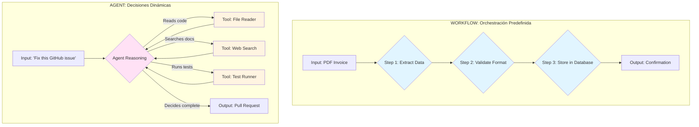

**Workflows** son deterministas. Sabes exactamente qué va a pasar. Son perfectos para procesos bien definidos: procesamiento de facturas, pipelines ETL, aprobaciones secuenciales.

**Agents** son probabilísticos. El modelo decide qué herramientas usar, en qué orden, cuántas veces. Son esenciales para problemas abiertos: resolver bugs, investigación, customer support complejo.

Gartner predice que **40% de las aplicaciones enterprise usarán agentes para fines de 2026**, comparado con <5% en 2025. Pero el 82% de esos "agentes" serán en realidad workflows con un poco de razonamiento LLM en puntos específicos. Y está bien —es el approach correcto para la mayoría de casos.

### 1.3 Las Capacidades Core de un Sistema Agéntico

Un agente moderno no es solo "LLM + prompt". Es una arquitectura con componentes claramente definidos:

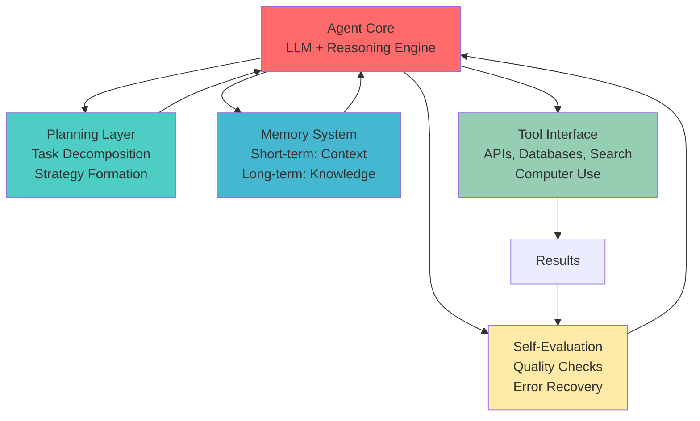

**1. Planning (Planificación)**

El agente necesita descomponer "Fix the authentication bug in production" en pasos concretos: leer logs, identificar el archivo afectado, reproducir el error, proponer fix, ejecutar tests. Los mejores sistemas usan variantes de ReAct (Reasoning + Acting) o Chain-of-Thought especializado.

**2. Memory (Memoria)**

Dos tipos críticos:
- **Short-term**: El contexto de la conversación actual. "El usuario mencionó que el error ocurre solo en Chrome."
- **Long-term**: Knowledge persistente cross-session. "Este usuario siempre trabaja con microservicios en Kubernetes."

En 2026, los sistemas productivos usan arquitecturas híbridas: vector databases para semantic retrieval + graph databases para relational context. Mem0 y MemGPT están dominando este espacio.

**3. Tool Use (Uso de Herramientas)**

El Model Context Protocol estandarizó esto. Un agente moderno tiene acceso a:
- APIs externas (búsqueda web, bases de datos)
- Computer use (browser, terminal, file system)
- Domain-specific tools (calculadoras, simuladores, compilers)

La clave está en **tool documentation**. Los modelos alucinan menos cuando las herramientas están perfectamente documentadas en el prompt.

**4. Self-Evaluation (Auto-Evaluación)**

Los agentes que escalan tienen loops de verificación. Después de generar código, corren tests. Después de escribir un reporte, verifican facts contra fuentes. El pattern "Evaluator-Optimizer" de Anthropic es fundamental aquí.

---

## 2. El Landscape de Arquitecturas

### 2.1 Single-Agent: Cuándo lo Simple Gana

La arquitectura más común en producción es **un solo agente con múltiples herramientas**. Ejemplo: Elastic AI Assistant, que ayuda a equipos de DevOps a query sus logs y métricas.

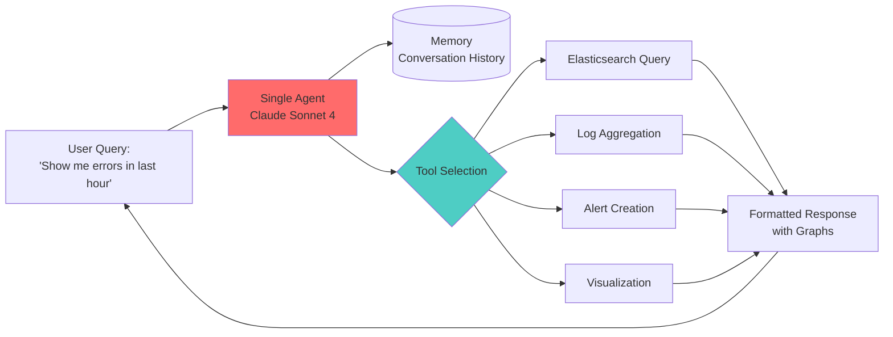

**Cuándo usar single-agent:**
- Dominio único y bien definido
- <10 herramientas disponibles
- Latencia crítica (<2 segundos)
- Equipo pequeño (1-5 devs)

**Real-world performance:**
- Latency típica: 800ms - 2s
- Success rate: 75-90% (dependiendo de task complexity)
- Cost: $0.01 - $0.10 por request

LinkedIn usa este approach para su SQL Bot interno. Un solo agente traduce preguntas en lenguaje natural a SQL queries, con acceso a schema documentation y query validator. Resultado: empleados non-technical pueden hacer data analysis.

### 2.2 Multi-Agent: Cuando la Especialización Importa

El salto a multi-agent systems se justifica cuando:
- Múltiples dominios claramente separados
- Tasks que naturalmente se paralellizan
- Necesidad de deep expertise en áreas específicas

#### Patrón: Orchestrator-Worker

Anthropic lo usa en su Research system. Es el patrón más probado en producción:

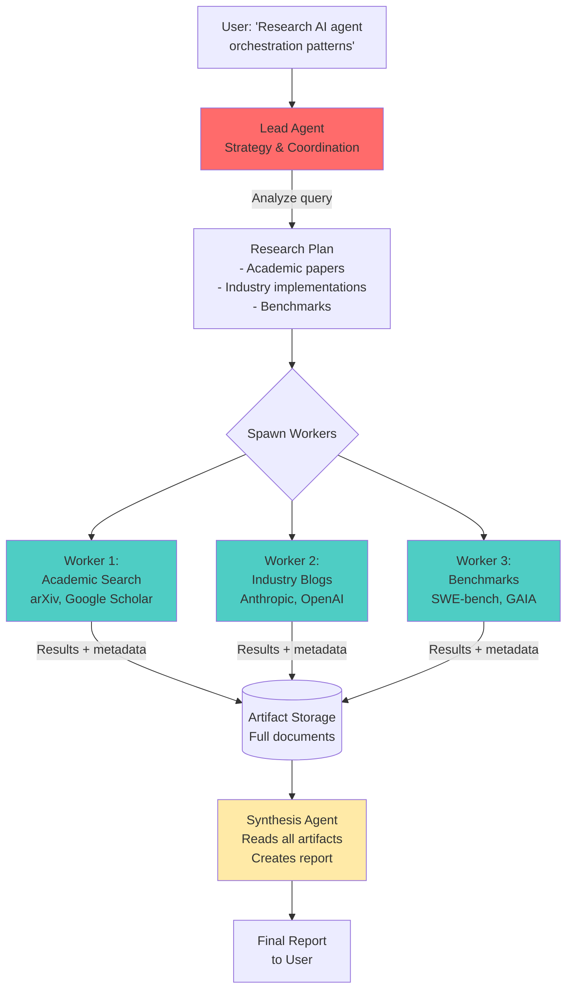

**Key Insights de Anthropic Research:**

1. **Teach orchestrators to delegate bien**
   - Instrucciones vagas ("research AI") → workers duplican trabajo
   - Instrucciones específicas ("find papers on multi-agent coordination published after 2024") → división efectiva

2. **Scale effort to query complexity**
   - Query simple ("Who won Euro 2024?") → 1 worker
   - Query complejo ("Compare approaches to agent memory") → 3-5 workers
   - Research profundo → 5-10 workers

3. **Artifact systems > message passing**
   - ❌ Worker → Orchestrator → "Found 10 papers about X"
   - ✅ Worker → Filesystem → Full results saved, Orchestrator reads cuando necesita

4. **External memory para evitar context overflow**
   - Lead agent summarizes work phases
   - Guarda en external storage antes de context limit
   - Spawns fresh workers con contexto limpio cuando necesario

**Production metrics:**
- Latency: 10-30 segundos (paralelización compensa)
- Quality: 15-20% mejor que single-agent en tasks complejos
- Cost: 3-5x más que single-agent
- Success rate: 85-95% en research tasks

### 2.3 Hierarchical Multi-Agent: La Org Chart Digital

Cuando necesitás especialización profunda Y coordinación cross-domain, entran las jerarquías:

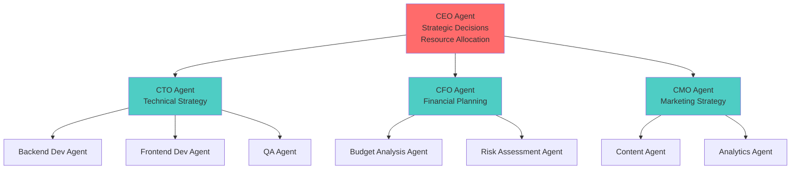

Este pattern está emergiendo en **enterprise SaaS multi-tenant**. Cada "departamento" es un pod de agentes especializados. Rexera (AI para real estate) migró de CrewAI a LangGraph específicamente porque necesitaban este nivel de control: diferentes pods para transacciones comerciales vs residenciales, cada uno con su propia jerarquía.

**Cuándo usar hierarchical:**
- Múltiples dominios con governance separada
- Compliance requirements por "departamento"
- Multi-tenant donde cada cliente tiene su org structure
- Equipos >20 personas trabajando en el sistema

### 2.4 La Realidad de la Adopción

Salesforce predice "2026 será el año del lonely agent" — empresas crearán cientos de agentes por empleado, pero la mayoría estarán idle. Como software licenses que nadie usa.

El problema no es técnico. Es organizacional:
- **67% de organizaciones están experimentando** con agentes
- **Solo 24% los han llevado a producción**
- **Los que sí escalan son 3x más likely** a haber rediseñado workflows, no solo agregado IA encima

McKinsey lo resume: *"El éxito requiere redesign de procesos, no adición de agentes."*

---

## 3. Patrones de Diseño que Funcionan

Anthropic documentó seis building blocks composables en "Building Effective Agents". Estos no son teóricos — son los patrones que LinkedIn, Replit, Elastic, y cientos de otros usan en producción.

### 3.1 Augmented LLM: El Baseline

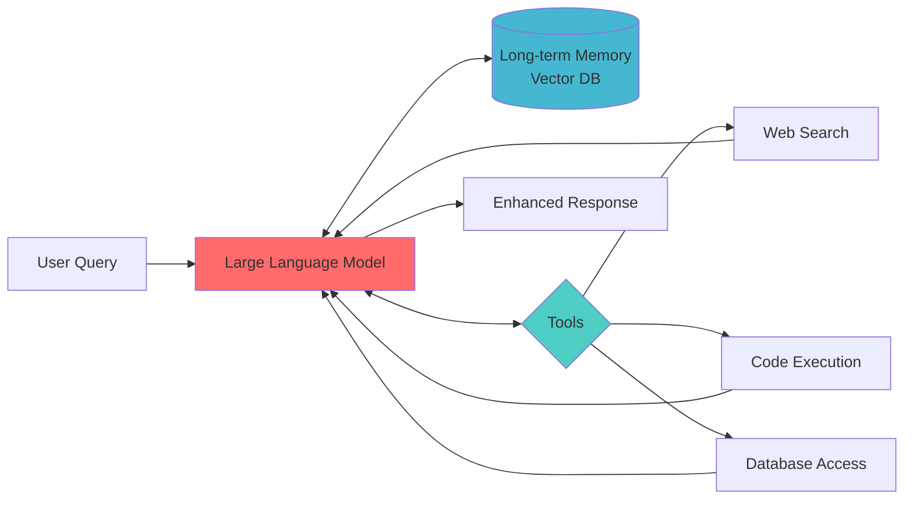

Este es ChatGPT con plugins. El modelo puede buscar, ejecutar código, acceder datos. Es el 80% de los "agentes" en producción.

**Ventajas:** Simple, predecible, fácil debugging
**Límites:** No planning multi-step, context overflow en tasks complejos

### 3.2 Prompt Chaining: Sacrificar Latencia por Calidad

Cuando la calidad importa más que la velocidad:

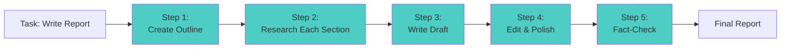

Cada step es un LLM call separado. Output del anterior se convierte en input del siguiente.

**Trade-off:** 5x latencia, 30% mejor quality
**Cuándo usar:** Content creation, reports críticos, legal documents

### 3.3 Routing: Especialización Inteligente

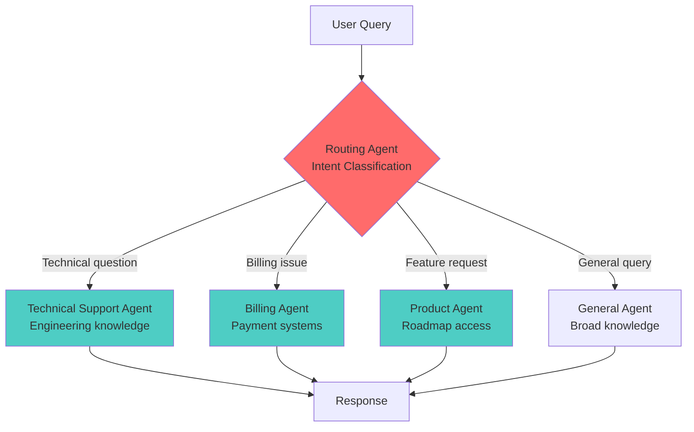

El router es un modelo pequeño y rápido (Haiku, GPT-3.5). Los specialists son modelos grandes (Sonnet, GPT-4).

**Ahorro típico:** 60% en costs (la mayoría de queries van a modelos baratos)

### 3.4 Parallelization: Velocidad Sobre Secuencialidad

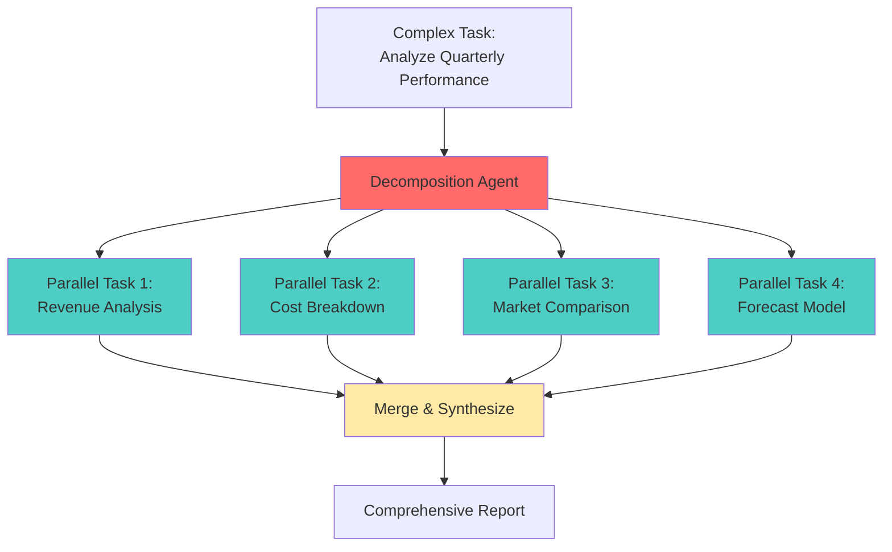

**Latency gain:** 70% reduction vs sequential
**Complexity cost:** Merge logic puede ser tricky
**Best fit:** Independent subtasks con outputs estructurados

### 3.5 Evaluator-Optimizer: El Loop de Calidad

El patrón favorito para content creation:

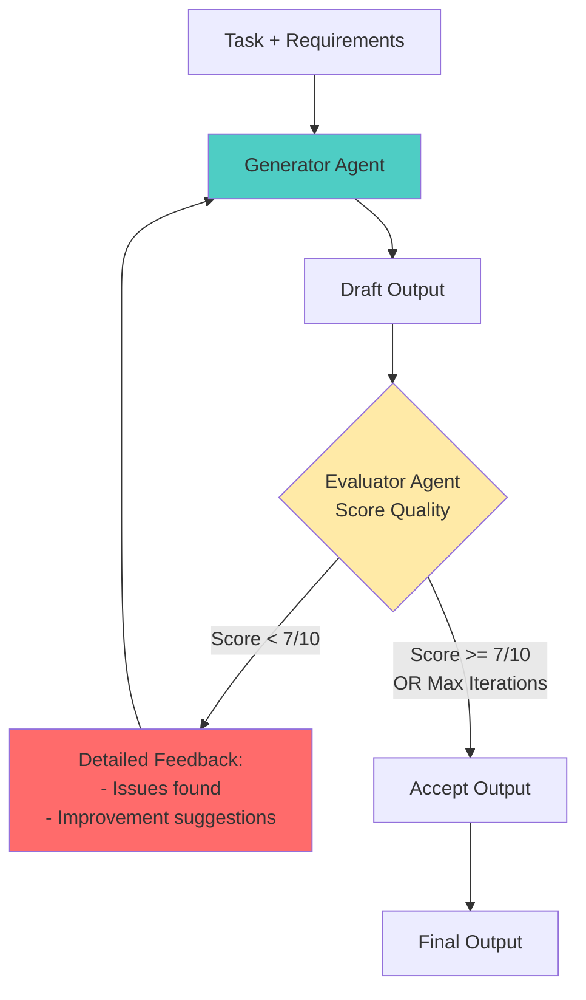

Anthropic usa esto en Claude Code. El agente genera código, otro agente lo evalúa contra tests y best practices, feedback loop hasta que pasa quality bar.

**Costo:** 2-4x más tokens
**Benefit:** 40-60% menos errores en output final
**Production tip:** Set max iterations (típicamente 3) para evitar infinite loops

### 3.6 El Principio de Composición

Lo poderoso no es cada patrón individual. Es **cómo los combinás**:

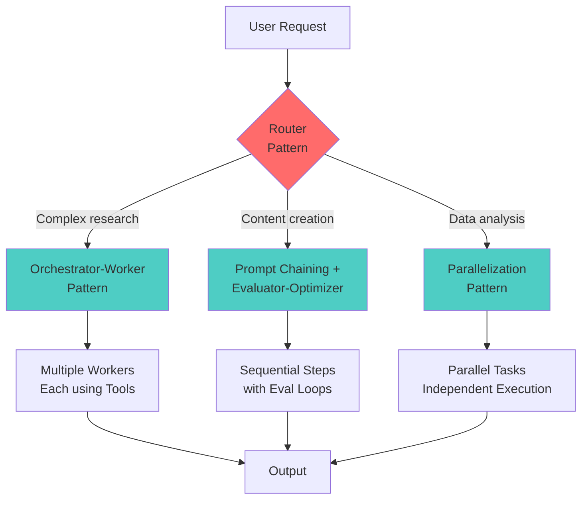

Replit Agent (coding assistant en producción) usa:
1. Router para clasificar tipo de request
2. Orchestrator-Worker para tasks complejos (múltiples archivos)
3. Evaluator-Optimizer para verificar código generado
4. Parallelization cuando puede ejecutar tests independientes

El resultado: **50% acceptance rate de código generado** (vs ~30% en coding assistants simples).

---

## 4. La Infraestructura: Más Allá de los Frameworks

### 4.1 El Landscape de Frameworks en 2026

Enero 2026 trajo consolidación. El top de frameworks según búsquedas de desarrolladores:

**Tier 1: Production-Ready**
- **LangGraph** - El estándar para stateful workflows. LangChain migró su propia infraestructura aquí.
- **AutoGen** - Microsoft's choice para conversational multi-agent. Fuerte en research.
- **OpenAI Agents SDK** - Released en 2025, ganando tracción rápido por simplicidad.

**Tier 2: Specialized**
- **CrewAI** - Role-based teams, lightweight
- **LlamaIndex** - Data-heavy applications
- **Haystack** - RAG-first approach

**Tier 3: Emerging**
- **LangFlow** - No-code/low-code builder
- **n8n** - Workflow automation con AI
- **Google ADK** - Agent Development Kit, nuevo

La verdad incómoda: **60% de production systems no usan ningún framework**. Construyen custom usando primitives básicos (LLM API + function calling + custom orchestration).

¿Por qué? Frameworks agregan abstraction layers que complican debugging. En producción, querés control total.

### 4.2 El Stack Técnico Real

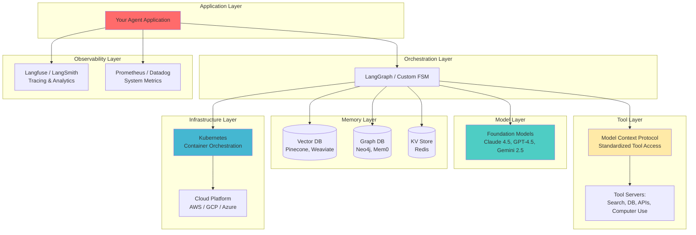

**Layer 1: Foundation Models**

2026 es el año de "modelo correcto para el job":
- **Reasoning tasks:** Claude Opus 4.5, o1-preview
- **General intelligence:** Claude Sonnet 4, GPT-4.5
- **Speed/cost:** Claude Haiku 3.5, GPT-4o-mini
- **Open source:** DeepSeek-R1, Llama 4

La tendencia: **SLMs (Small Language Models) fine-tuned** para tasks específicos están ganando. AT&T reporta que fine-tuned SLMs son "el big trend de 2026" por cost-performance.

**Layer 2: Model Context Protocol**

El game-changer de 2025. MCP es a tool access lo que REST fue a APIs.

Antes de MCP:
```
Agent → Custom integration → Tool 1
Agent → Different integration → Tool 2
Agent → Another integration → Tool 3
```

Con MCP:
```
Agent → MCP Server → All Tools (standardized)
```

Linux Foundation's Agentic AI Foundation lo adoptó como standard. OpenAI, Anthropic, Google todos lo soportan. Si estás construyendo agents en 2026 sin MCP, estás haciendo legacy tech.

**Layer 3: Memory Architecture**

Esto merece su propia sección...

---

## 5. Memory: El Cuello de Botella Real

### 5.1 Por Qué Memory Define Success

Un agente sin memoria es un empleado con amnesia. Puede razonar brillantemente cada vez, pero empieza de cero en cada conversación.

En 2026, la diferencia entre demos y producción está en memory architecture. Los sistemas que escalan tienen estrategias sofisticadas para:
- Qué recordar
- Por cuánto tiempo
- Cómo retrievar eficientemente
- Cuándo olvidar

### 5.2 La Arquitectura de Tres Capas

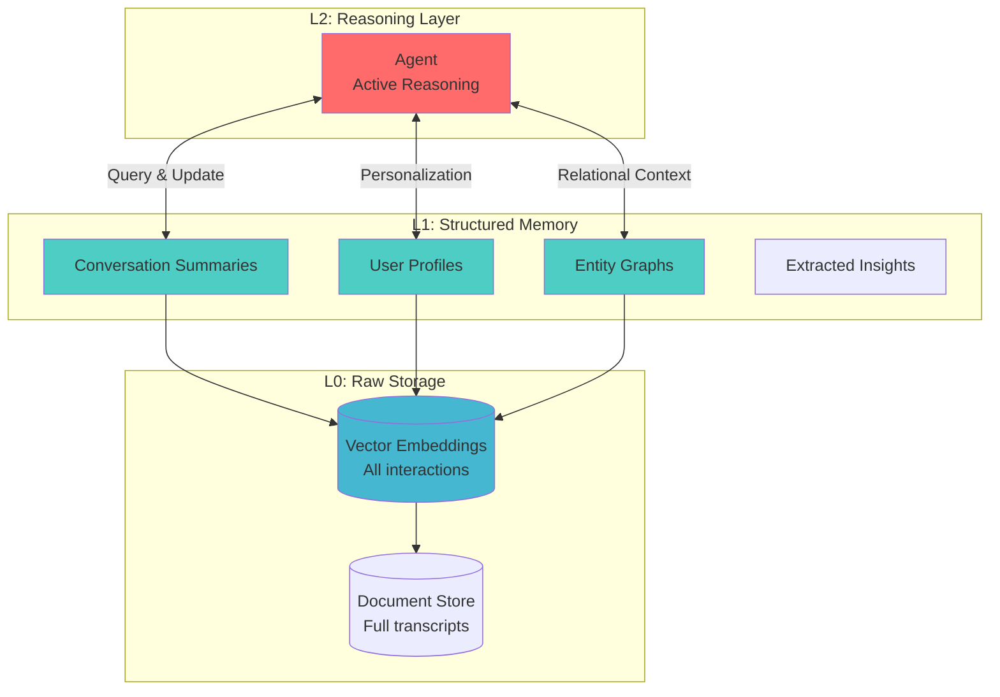

**L0 (Raw Data)**
- Todo se guarda: conversations, documents, actions
- Vector embeddings para semantic search
- Retrieval: "Find similar past interactions"

**L1 (Structured Memory)**
- Summaries: "Last conversation was about deploying to K8s"
- Profiles: "User is a senior DevOps engineer, prefers Terraform"
- Entity Graphs: "Company uses AWS, has 3 environments: dev/staging/prod"

**L2 (Active Reasoning)**
- Agent query L1 para contexto relevante
- Falla back a L0 si L1 insuficiente
- Updates L1 basado en nueva información

### 5.3 RAG vs Agentic RAG

Traditional RAG está muerto. En 2026, si no sos agentic, no competís:

**Traditional RAG (2023-2024)**
```
Query → Retrieve top-k chunks → Stuff in context → Generate
```

Problems:
- Chunk boundaries rompen contexto
- Top-k puede perder información relevante
- No multi-hop reasoning
- Estático, no adaptativo

**Agentic RAG (2026)**
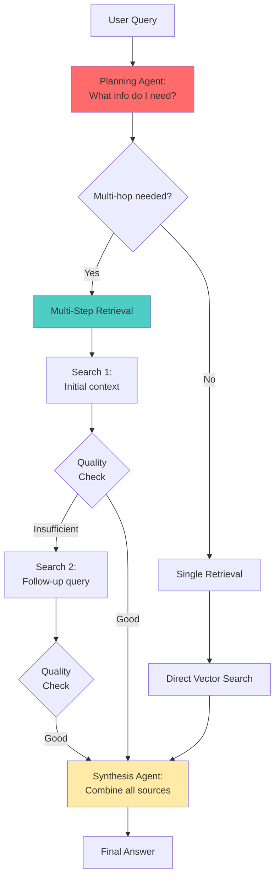

El agente **decide** qué retrieval strategy usar. Si la primera búsqueda no es suficiente, hace follow-ups. Si encuentra contradicciones, busca más fuentes.

**Performance improvement:** 35-50% better answer quality en benchmarks

### 5.4 Memory Decay: El Problema que Nadie Habla

Humans olvidan. Agents deberían también. Información vieja puede ser:
- Obsoleta ("El bug se fixeó la semana pasada")
- Irrelevante ("Mencionó su color favorito hace 6 meses")
- Misleading ("Pricing cambió, esos números ya no aplican")

MemoryBank implementa la curva de Ebbinghaus:

```
Memory Strength = Importance × e^(-decay_rate × days_elapsed)
```

Memories se "fade" con tiempo. Pero pueden revivirse si vuelven a ser relevantes.

En producción: TTL (Time To Live) indexes en MongoDB, automatic cleanup de memories con score bajo.

---

## 6. Evaluación en la Era Post-Benchmark

### 6.1 El Estado de Benchmarks en 2026

Los benchmarks académicos siguen siendo importantes, pero la industria se movió:

**The Big 3**
1. **SWE-bench Verified** - 500 GitHub issues human-validated
2. **GAIA** - General AI assistant tasks, real-world
3. **MLE-bench** - ML engineering tasks end-to-end

**Current SOTA (Enero 2026):**
- SWE-bench Verified: ~52% (Claude Sonnet 4 con custom harness)
- GAIA: ~89% (AgentOrchestra, hierarchical multi-agent)
- MLE-bench: ~45% (aún difícil, requiere días de work)

Pero hay un problema: **benchmarks lag capabilities**.

El momento que un benchmark se publica, equipos lo over-fit. SWE-bench Verified era "impossible" en 2024. En 2026, es commoditized.

### 6.2 Production Evaluation: Lo que Realmente Importa

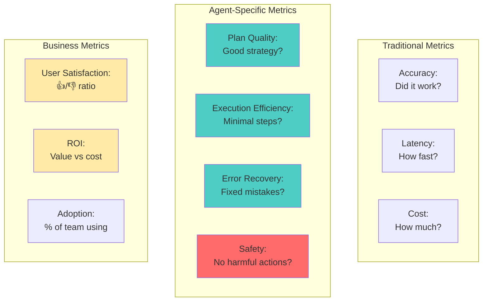

McKinsey: *"Boards will stop counting tokens and pilots and start counting dollars."*

Real evaluation en 2026:
- ✅ Did the agent save the SE 2 hours?
- ✅ Did it reduce support tickets by 30%?
- ✅ Is the team actually using it daily?

Not:
- ❌ What's the BLEU score?
- ❌ Does it pass benchmark X?

### 6.3 Testing Pyramid para Agents

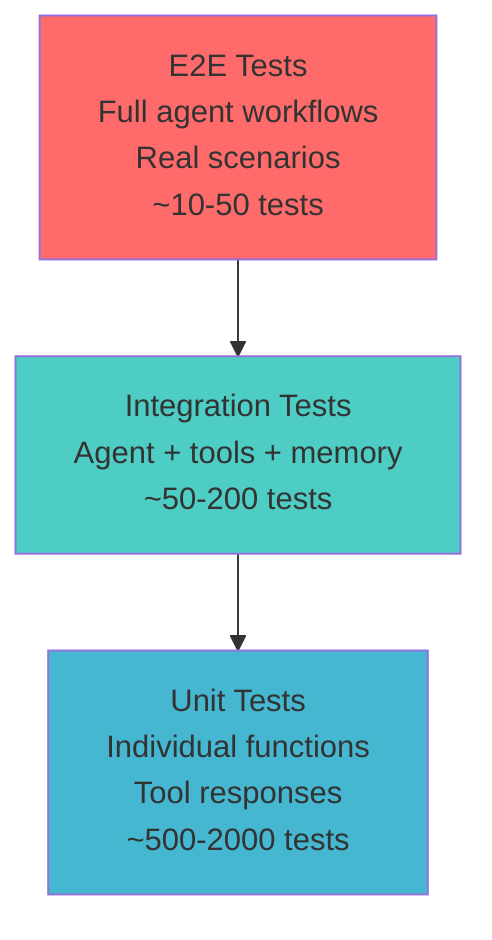

**Layer 1: Unit Tests**
- Tool responses son correctos?
- Memory retrieval funciona?
- Individual components aislados

**Layer 2: Integration Tests**
- Agent + tools juntos?
- Memory persistence cross-sessions?
- Error handling end-to-end?

**Layer 3: E2E Tests**
- User scenarios reales
- Edge cases conocidos
- Regression suite de production failures

**Production tip:** E2E tests corren contra exact same production stack (staging environment). No mocks. Real LLM calls, real databases.

---

## 7. Observability: Ver lo Invisible

### 7.1 Por Qué Agents Son Diferentes

Debuggear un web service: logs, stack traces, predecible.

Debuggear un agent: *"¿Por qué decidió usar la herramienta equivocada?"*

El problema es que el agent's decision-making es opaco. El LLM razona internamente, luego output es una acción. Sin observability, estás volando ciego.

### 7.2 La Estructura de Tracing

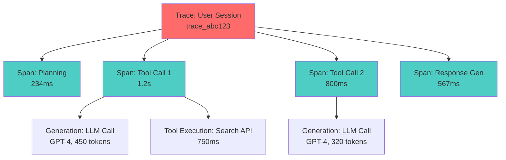

Cada **Trace** es una user session completa.
Cada **Span** es una operación individual.
Dentro de spans: **Generations** (LLM calls), **Retrievals** (DB queries), **Tool executions**.

**What you track:**
- Input/output de cada step
- Latency por component
- Token usage (cost)
- Errors y retry attempts
- Model parameters (temperature, max_tokens)

### 7.3 Langfuse vs LangSmith: La Decisión en 2026

| Criterio | Langfuse | LangSmith |
|----------|----------|-----------|
| **Open Source** | ✅ MIT License | ❌ Proprietary |
| **Self-Hosting** | ✅ Full support | ⚠️ Enterprise only |
| **Framework Support** | ✅ Agnostic | ⚠️ Best with LangChain |
| **Latency Overhead** | ~15% | ~8% |
| **Free Tier** | 50K traces/month | 5K traces/month |
| **UI Quality** | Good | ⭐ Excellent |
| **Setup Time** | 1-2 hours | 10 mins (LangChain) |
| **Enterprise Features** | Self-host | Managed |

**2026 Winner:** Depends

- **LangChain/LangGraph shops:** LangSmith (native, lowest friction)
- **Multi-framework or custom:** Langfuse (agnostic, open-source)
- **Self-hosting required:** Langfuse (only option)
- **Lean startup:** Langfuse (generous free tier)

Anthropic internamente usa custom observability (no sorpresa). OpenAI teams usan mix de LangSmith y internal tools. Google pushing its own Vertex AI monitoring.

### 7.4 El Dashboard que Importa

No necesitás 50 metrics. Necesitás estas:

```
┌─────────────────────────────────────────┐
│ AGENT PERFORMANCE - Last 24h           │
├─────────────────────────────────────────┤
│ Total Requests: 12,450                  │
│ Success Rate: 87.3% ↑                   │
│ Avg Latency (p95): 2.1s ↓              │
│ Cost: $342.50 ↑                         │
│ Error Rate: 3.2% →                      │
└─────────────────────────────────────────┘

Top Errors (last 24h):
1. Tool timeout (45 occurrences)
2. Context overflow (23 occurrences)
3. Rate limit hit (12 occurrences)

Slowest Traces:
1. trace_xyz789 - 12.3s (research query)
2. trace_abc456 - 8.7s (multi-step task)

Highest Cost Traces:
1. trace_def123 - $4.50 (used GPT-4 + 15 tool calls)
```

Esto es actionable. Ves que tool timeouts son tu #1 problem. Investigás, descubrís que el search API está lento. Switcheas a provider más rápido o aumentás timeout. Done.

---

## 8. Production Deployment en 2026

### 8.1 La Arquitectura Real

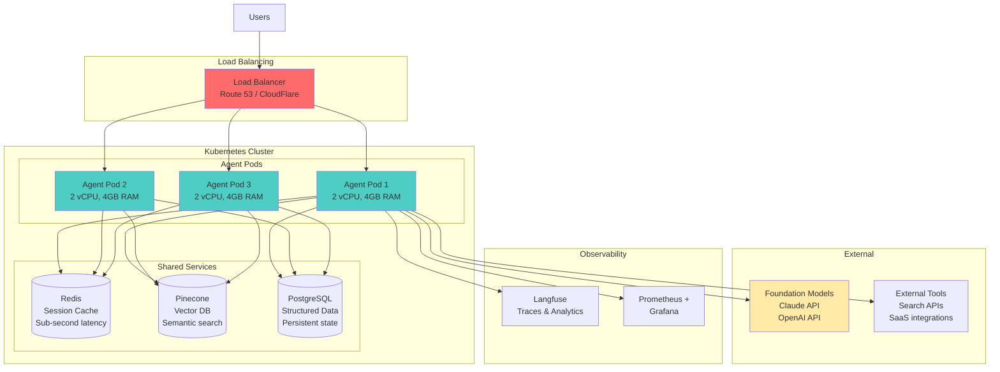

**Key decisions:**

1. **Containerization:** Docker, siempre. Portability + consistency.

2. **Orchestration:** Kubernetes wins. Autoscaling, health checks, rolling updates out-of-the-box.

3. **Caching:** Redis para:
   - Session state (conversation context)
   - Hot data (frequently accessed memories)
   - Rate limit tracking

4. **Persistence:** PostgreSQL + Vector DB split:
   - Structured data → Postgres
   - Semantic search → Pinecone/Weaviate
   - Optional: Neo4j para graph relationships

### 8.2 Autoscaling en 2026

La belleza de agents es que son stateless (memory está en external storage). Esto hace autoscaling trivial:

```yaml
apiVersion: autoscaling/v2
kind: HorizontalPodAutoscaler
metadata:
  name: agent-hpa
spec:
  scaleTargetRef:
    apiVersion: apps/v1
    kind: Deployment
    name: agent-deployment
  minReplicas: 3
  maxReplicas: 20
  metrics:
  - type: Resource
    resource:
      name: cpu
      target:
        type: Utilization
        averageUtilization: 70
  - type: Resource
    resource:
      name: memory
      target:
        type: Utilization
        averageUtilization: 80
  behavior:
    scaleUp:
      stabilizationWindowSeconds: 60
      policies:
      - type: Percent
        value: 50
        periodSeconds: 60
    scaleDown:
      stabilizationWindowSeconds: 300
      policies:
      - type: Percent
        value: 10
        periodSeconds: 60
```

**Key:** `stabilizationWindowSeconds` previene flapping (scale up/down constante).

**Real-world:** LinkedIn's SQL Bot autoscales de 3 pods (off-hours) a 15 pods (business hours peak). Cost optimization automática.

### 8.3 Security: El Top 3 de Vulnerabilities

Exabeam's January 2026 report sobre "AI Agent Security":

**#1: Prompt Injection**
Agent diseñado para generar quarterly reports es tricked por malicious prompt. Empieza a exfiltrar data.

**Mitigation:**
- Input validation estricta
- Sandboxed execution environments
- Output filtering (no credentials, no PII)

**#2: Unauthorized Tool Access**
Agent accede a tools que no debería (prod DB en vez de staging).

**Mitigation:**
- Least privilege principle
- Tool access controls por role
- Audit logs de todas las tool calls

**#3: Data Leakage**
Stanford researchers en enero 2026 extrajeron Harry Potter completo de Claude 3.7 Sonnet usando adversarial prompts.

**Mitigation:**
- PII detection y redaction
- Output sanitization
- Compliance-specific guardrails (GDPR, CCPA)

**Production pattern:** Security agent que monitorea otros agents. Meta-observability.

---

## 9. Decisiones de Arquitectura y Trade-offs

### 9.1 Framework Selection: El Decision Tree

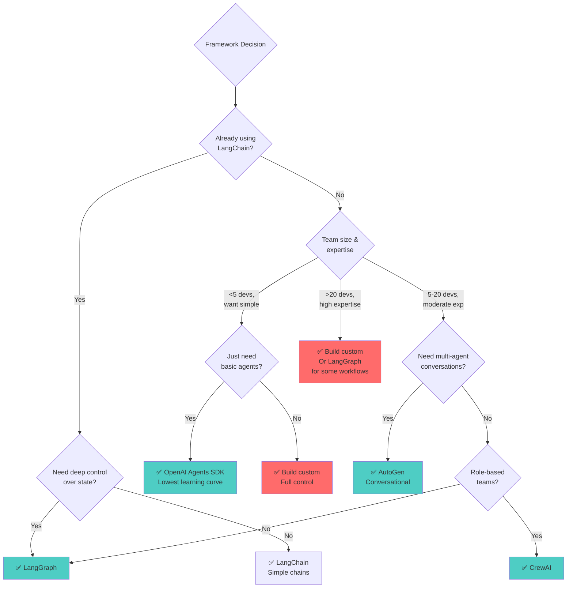

**2026 Reality Check:**

60% de production systems **no usan framework**. Construyen custom porque:
- Debugging frameworks es hell
- Abstractions leak en lugares inesperados
- Performance overhead (frameworks agregan 10-20% latency)
- Lock-in a ecosystem específico

Pero frameworks son perfectos para:
- Prototyping rápido
- Equipos sin deep agent expertise
- Standard patterns bien soportados

**Anthropic's advice:** *"Start simple. Add complexity only when it clearly improves performance."*

### 9.2 Memory Strategy Trade-offs

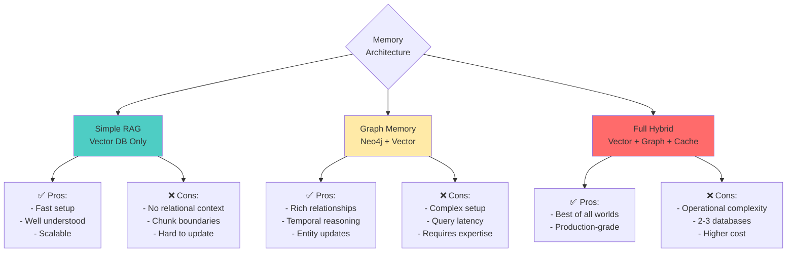

**Recommendation Path:**

**Month 1-2:** Vector DB only (Pinecone)
- Get basic RAG working
- Learn what queries matter
- Understand retrieval patterns

**Month 3-4:** Add graph if needed (Neo4j)
- When relational queries become critical
- Entity relationships matter
- Temporal reasoning required

**Month 5+:** Optimize hybrid
- Redis cache para hot data
- Query optimization
- Cost management

### 9.3 Single vs Multi-Agent: The Matrix

| Factor | Single Agent | Multi-Agent |
|--------|--------------|-------------|
| **Latency** | 0.5-2s | 2-30s |
| **Cost per Request** | $0.01-0.10 | $0.05-0.50 |
| **Development Time** | 1-2 weeks | 1-3 months |
| **Team Size** | 1-3 devs | 5+ devs |
| **Debugging Complexity** | Low | High |
| **Success Rate** | 75-85% | 85-95% |
| **Specialization** | Low | High |
| **Scalability** | Vertical | Horizontal |

**When Single Wins:**
- Latency < 2s requirement
- Budget constrained
- Small team
- Well-defined domain

**When Multi Wins:**
- Complex multi-domain tasks
- Quality > speed
- Large team (can parallelize development)
- Need for specialization

**2026 Pattern:** Start single, migrate to multi when hitting clear limitations.

---

## 10. Tendencias y Fronteras de Investigación

### 10.1 Lo que Está Pasando AHORA (Enero 2026)

**1. MCP Everywhere**

Model Context Protocol se convirtió en el standard overnight. Linux Foundation's Agentic AI Foundation lo adopted. Google lanzó managed MCP servers. Microsoft integró en Azure.

**Impact:** Tool integration pasó de "custom code por cada tool" a "plug and play". Esto es el momento HTTP para agents.

**2. SLMs Fine-Tuned > General LLMs**

AT&T, Box, Salesforce, todos reportan lo mismo: small language models fine-tuned para tasks específicos **outperform** general LLMs a fracción del costo.

Ejemplo: SLM de 7B fine-tuned para SQL generation beats GPT-4 en queries específicas de su schema. 10x más barato, 3x más rápido.

**Trend:** 2026 es el año de specialist models.

**3. World Models Emergen**

LeCun left Meta para empezar un world model lab ($5B valuation target). Google's Genie 2 genera interactive 3D environments. OpenAI rumored working on similar.

**Why it matters:** LLMs razonan sobre lenguaje. World models razonan sobre physics, espacios 3D, causality. Esto unlocks robotics, embodied AI, simulation.

**4. Agentic Browsers**

Opera Neon, Microsoft Edge Copilot, Browser Company's Dia. El browser dejó de ser interface pasivo. Ahora es participant activo.

**Example:** "Book me a vacation to Japan" → Agent searches flights, compara hotels, completa checkout. No más 50 tabs abiertos.

**5. Agent Security Becomes Priority**

80% de enterprises deployando agents crearon nueva attack surface. Exabeam lanzó AI Agent Security suite. Nuevos frameworks de compliance.

**Reality:** Security no es afterthought en 2026. Es Day 1 requirement.

### 10.2 Las Limitaciones que Aún Existen

**1. Long-Horizon Tasks**

SOTA agents ~50% success en SWE-bench (tasks 15min-1hr).
SOTA agents <5% success en tasks 4+ horas.

Context overflow, planning degradation, error accumulation. No hay solución clara aún.

**2. Cost at Scale**

Multi-agent systems con GPT-4 level models cuestan $0.50+ por request complejo. A escala de millones de users, eso es insostenible.

**Path forward:** SLMs fine-tuned, caching agresivo, routing inteligente.

**3. Reliability**

Agents son probabilísticos. Success rates 75-95%. Pero producción requiere 99.9%.

**Workaround:** Human-in-the-loop para decisiones críticas. Agents draft, humans approve.

**4. Evaluation Lag**

Benchmarks son snapshot del pasado. Capabilities avanzan más rápido que evaluation methods.

**Emerging:** Continuous evaluation en production. Real user feedback > static benchmarks.

### 10.3 Research Directions Exciting

**Self-Improving Agents**

```mermaid
graph LR
    Agent --> Execute[Execute Tasks]
    Execute --> Results[Results & Failures]
    Results --> Learn[Self-Reflection<br/>& Learning]
    Learn --> Update[Update Prompts<br/>& Memory]
    Update --> Agent
    
    style Learn fill:#ffeaa7
    style Update fill:#4ecdc4
```

Agents que mejoran con uso. Automatic prompt optimization, memory consolidation, tool usage patterns.

Early work: Microsoft's Autogen con reflection, Anthropic's constitutional AI principles.

**Multi-Modal Agentic Systems**

Vision + Language + Action. Anthropic's Computer Use es el preview. Agent que puede:
- Ver screens
- Read documents
- Navigate browsers
- Interact con UIs

**Prediction:** 2027 será el año de embodied agents (robots con agent brains).

**Formal Verification**

¿Podemos *probar* que un agent hará lo correcto? Research en bounded autonomy, safety guarantees, formal methods aplicados a LLMs.

**Why it matters:** Regulación va a requerir esto. Finance, healthcare, critical infrastructure no van a aceptar "probably works most of the time".

**Agent-to-Agent Communication**

Google's A2A (Agent2Agent) protocol. Agents de diferentes providers hablando entre sí.

**Vision:** Tu coding agent (Anthropic) colabora con data analyst agent (OpenAI) colabora con deployment agent (Google). Interoperability.

---

## Conclusión: El Pragmatismo de 2026

Si 2025 fue hype, 2026 es ejecución.

Los demos son fáciles. Production es hard. La diferencia está en:

1. **Arquitectura bien pensada** - No el framework más nuevo, el pattern correcto
2. **Memory estratégica** - No "guardemos todo", qué es relevante y retrievable
3. **Observability desde día 1** - No "lo agregamos después", lo instrumentamos ahora
4. **Security no-negotiable** - No "lo vemos más adelante", lo diseñamos desde el inicio
5. **Evaluación pragmática** - No benchmarks académicos, métricas de negocio

**La oportunidad para builders en 2026:**

La infraestructura está madurando. MCP estandarizó tools. Frameworks consolidaron. Patterns están documentados. Security frameworks emergiendo.

Pero **solo 24% de organizaciones lograron llevar agents a producción**. El gap es enorme.

**Los que van a ganar:**

No son los que tienen el modelo más grande. Son los que:
- Entienden cuándo usar workflows vs agents
- Diseñan memory architecture correcta para su use case
- Implementan observability que permite debugging real
- Escalan de forma sostenible (cost + reliability)

**Tu próximo paso:**

No construyas "un agente". Construí **un sistema agéntico que resuelve un problema real para un usuario real y puede escalar a 1000 usuarios**.

Empezá simple. Single agent, 2-3 tools, memory básica. Deployá a staging. Instrumentá con observability. Conseguí users reales. Iterá basado en traces reales.

Cuando veas los patrones en failures, ahí sabés qué complejidad agregar.

Este es el momento. La infraestructura está lista. Los models son capaces. La industria está buscando solutions productionalizadas.

**El futuro no es predecir qué va a pasar. Es construirlo.**

---

## Referencias Seleccionadas (Enero 2026)

**Industry Reports:**
- TechCrunch: "In 2026, AI will move from hype to pragmatism"
- McKinsey: "Seizing the agentic AI advantage"
- Gartner: "40% of enterprise apps will use AI agents by end of 2026"
- Axios: "AI 2026 trends: bubbles, agents, demand for ROI"

**Technical:**
- Anthropic: "Building Effective Agents" + "Multi-Agent Research System"
- Linux Foundation: Agentic AI Foundation launch
- Exabeam: "AI Agent Security" (January 2026 report)
- Stanford: "Extracting copyrighted content from LLMs" (January 2026)

**Frameworks:**
- LangGraph Documentation (langchain.com/langgraph)
- AutoGen 0.4 Release Notes
- OpenAI Agents SDK (beta)
- Model Context Protocol Specification

**Benchmarks:**
- SWE-bench Verified leaderboard
- GAIA benchmark results
- MLE-bench analysis

**Production Case Studies:**
- LinkedIn SQL Bot (LangGraph in production)
- Replit Agent (multi-agent coding)
- Elastic AI Assistant (migration to LangGraph)
- Rexera (CrewAI → LangGraph journey)

---

*Documento actualizado: 28 Enero 2026*
*Para updates: El landscape cambia cada semana. Seguí a los teams construyendo en público.*