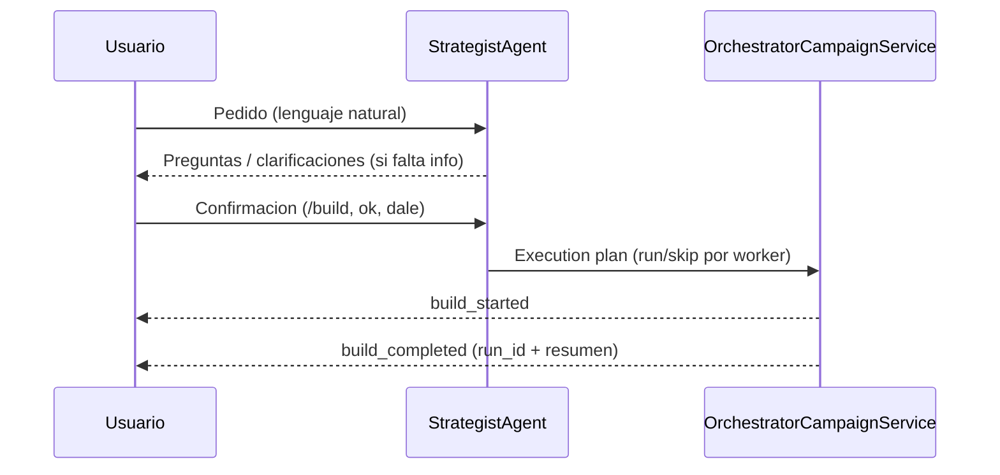
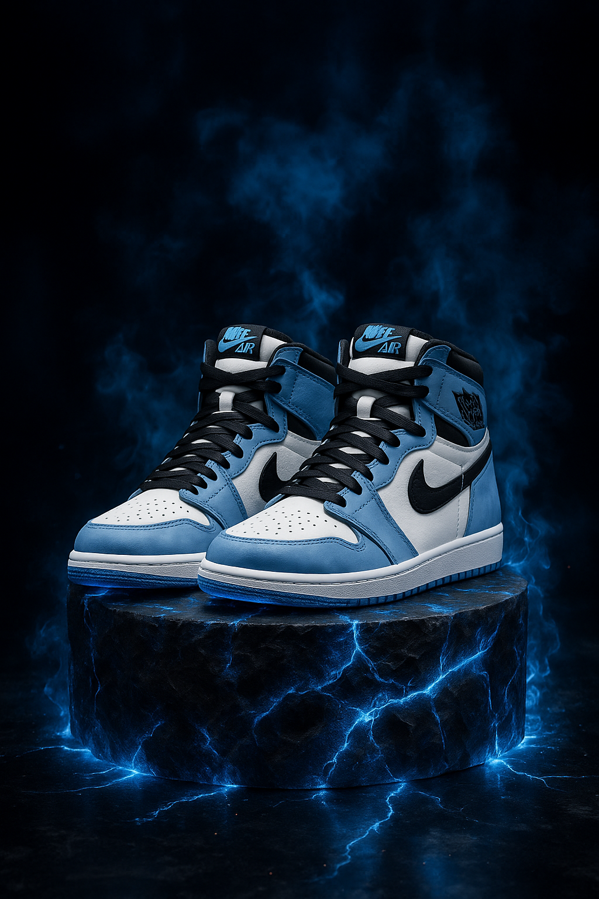
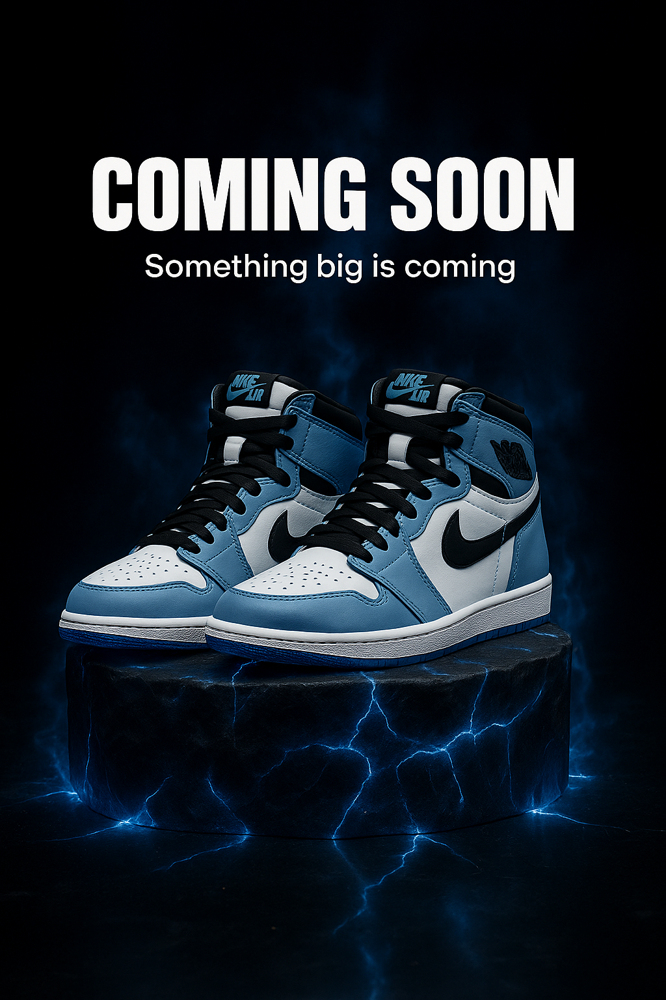
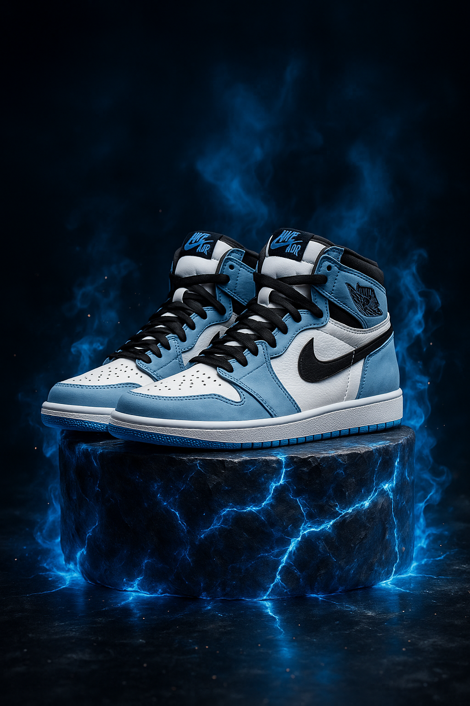
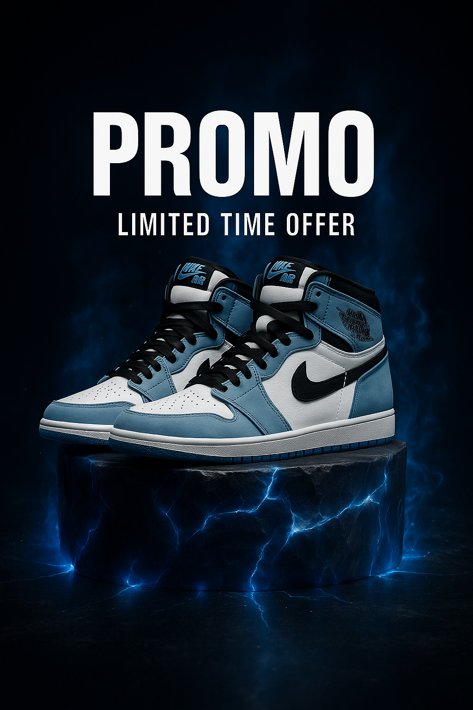
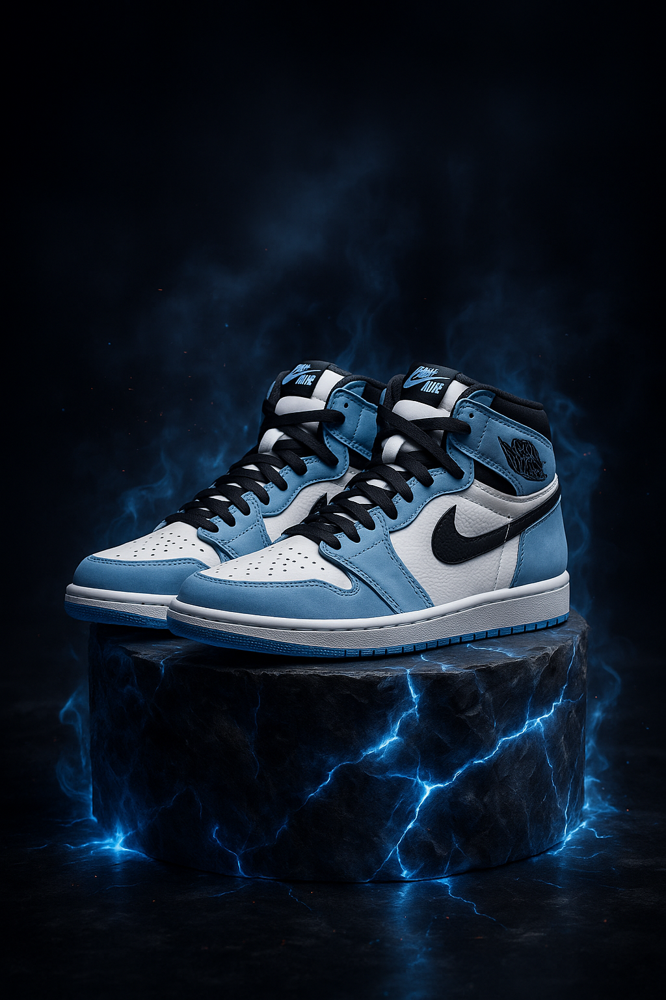
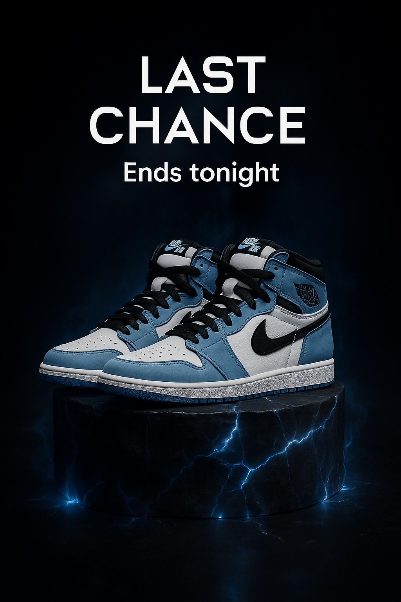
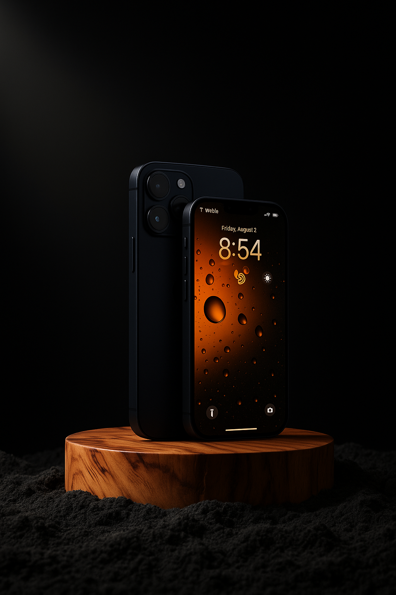
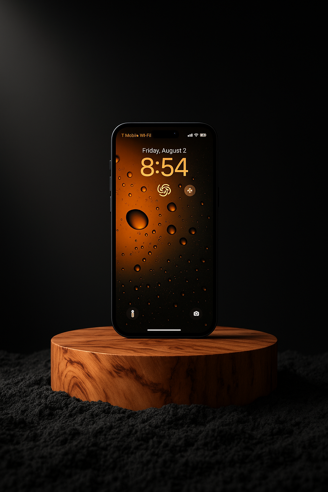
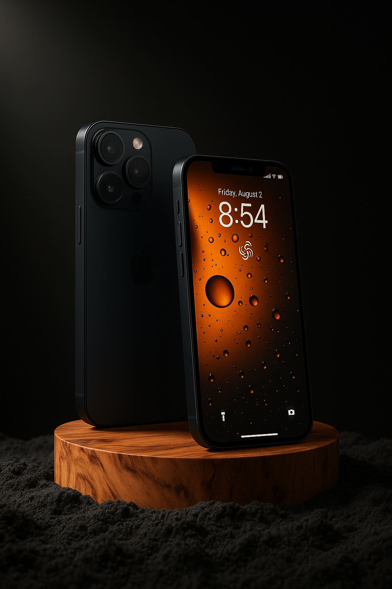

# CM Agents

Sistema de orquestación de agentes AI para automatizar la creación de contenido visual para redes sociales. Genera imágenes profesionales de productos con calidad de diseño de agencia, tomando inspiración de Pinterest y aplicando best practices de diseño 2026.

**Versión:** 0.1.0 | **Tests:** 87 pasando | **Seguridad:** Validación + Rate limiting

> **Estado:** MVP en desarrollo activo. No recomendado para producción sin hardening adicional.

## Qué hace

1. **Chat Inteligente**: Habla en lenguaje natural para crear planes de contenido
2. **Analiza** imágenes de referencia de Pinterest (estilo + producto) en una sola llamada
3. **Genera prompts** profesionales aplicando tendencias 2026 y tu identidad de marca
4. **Genera imágenes** con producto (réplica exacta), texto integrado, logo y estilo de la referencia

**Resultado**: Imágenes listas para Instagram con consistencia de marca, perfectas para campañas publicitarias.

### Incluye

- **API REST + WebSocket** funcional con chat en tiempo real
- **Frontend Next.js 16** con UI moderna y responsive
- **StrategistAgent** - Crea planes de contenido desde lenguaje natural
- **87 tests automatizados** - API, seguridad, y lógica de negocio
- **Seguridad básica** - Validación de inputs, rate limiting, CORS
- **Type-safe** - TypeScript + Pydantic con validaciones

## Arquitectura

Este proyecto se usa principalmente como **chat ida y vuelta**: el usuario pide, el Strategist pregunta lo que falta, y recien cuando el usuario confirma se ejecuta el build real.

### Chat -> Build (lo que pasa en runtime)



### Strategist como Orquestador (delegacion dinamica)

```mermaid
flowchart TD
    S[StrategistAgent] --> P[Worker plan\n(run/skip + reasons)]
    P --> R[Research\n(KB + LangSearch opcional)]
    P --> C[Copy\n(opcional: solo si include_text=true)]
    P --> D[Design\n(opcional)]
    P --> G[Generate\n(opcional: solo si build=true)]
    P --> Q[QA/Retry\n(opcional)]
    G --> A[(artifacts.json + report.md)]
    Q --> A
    R --> A
    C --> A
    D --> A
```

### Pipelines de imagen (workflows)

- `cm generate`: `CreativeEngine -> GeneratorAgent`
- `cm campaign-inpaint`: prompts coherentes + inpainting (con coherencia opcional)
- `cm campaign-refs`: base escena+producto + overlay de texto por referencia

## Ejemplos visuales

<p align="center">
  
  
  
</p>

<p align="center">
  
  
  
</p>

<p align="center">
  
  
  
</p>

<p align="center">
  
  
  
</p>

## Instalación

### Backend

```bash
# 1. Clonar e instalar
git clone <repo>
cd cm-agents
uv pip install -e ".[dev]"

# 2. Configurar API keys
cp .env.example .env
# Editar .env:
# ANTHROPIC_API_KEY=sk-ant-...
# OPENAI_API_KEY=sk-...
# LANGSEARCH_API_KEY=ls-...  # Opcional: activa web search de tendencias en ResearchWorker
# API_KEY=your-secret-key  # Opcional: Requiere X-API-Key header

# 3. Verificar
cm status

# 4. Iniciar servidor API
cm serve --port 8000 --reload
```

### Frontend

```bash
cd ui
bun install
bun dev  # http://localhost:3000
```

### Tests

```bash
# Backend
uv run pytest tests/ -v

# Frontend
cd ui
bun run lint
bun run build
```

## Uso

### Generación básica

```bash
# Con imagen del producto real (RECOMENDADO)
cm generate sprite mi-marca references/estilo.jpg -p references/sprite.webp

# Con estilo específico
cm generate sprite mi-marca ref.jpg -p producto.webp --style minimal_clean

# Múltiples tamaños (feed + story)
cm generate sprite mi-marca ref.jpg -p producto.webp -s feed -s story

# Asociar a una campaña
cm generate sprite mi-marca ref.jpg -p producto.webp --campaign promo-verano
```

### Gestión de Marcas

```bash
# Crear nueva marca (wizard interactivo)
cm brand-create mi-tienda

# Ver todas las marcas
cm brand-list

# Ver configuración completa de una marca
cm brand-show mi-marca
```

### Gestión de Campañas

```bash
# Crear campaña
cm campaign-create mi-marca promo-verano-2026

# Listar campañas de una marca
cm campaign-list mi-marca

# Ver detalles de campaña
cm campaign-show mi-marca promo-verano-2026

# Ejecutar campaña con inpainting
cm campaign-inpaint mi-marca promo-verano-2026
```

### Campaña por referencias (3 referencias)

Flujo con **1 producto + 1 escena + 1 fuente**: genera una imagen por día con variación automática de ángulo del producto (réplica exacta) y agrega texto por día usando la referencia de tipografía. Por defecto 3 días (teaser, main_offer, last_chance).

```bash
cm campaign-refs mi-marca -p foto-producto.jpg -s escena-fondo.png -f tipografia-muestra.png
cm campaign-refs mi-marca -p producto.png -s escena.png -f fuente.png --days 3 --output outputs/mi-campana
```

### Planes de Contenido (StrategistAgent)

```bash
# Crear plan desde lenguaje natural
cm plan-create "3 posts promocionales para hamburguesas 2x1" --brand mi-marca

# Listar planes
cm plan-list

# Ver detalles de un plan
cm plan-show <plan_id>

# Aprobar plan para ejecución
cm plan-approve <plan_id>

# Ejecutar generación de un plan aprobado
cm plan-execute <plan_id>
```

### Orchestrator MVP (CLI)

Comando mínimo para demostrar arquitectura Orchestrator + Specialists con bajo overhead.
El `Strategist` (LLM) decide la secuencia de workers (con fallback determinístico si no hay API key).
En modo build, el copy (headline/subheadline/theme) se inyecta al prompt por item.
Si existe `LANGSEARCH_API_KEY`, `ResearchWorker` agrega señales de web search automáticamente.

Política (fallback) de delegación dinámica:

- `research`: se ejecuta si faltan referencias de estilo (no `style_ref` y no `brands/<marca>/references/*`) o si el pedido menciona tendencias/inspiración
- `copy`: se ejecuta solo si `include_text=true` (por defecto, se apaga si el pedido dice "sin texto"/"sin copy")
- `design`: se ejecuta para builds (coherencia visual)
- `generate`: se ejecuta solo si `build=true`
- `qa`: se ejecuta solo si `build=true` y `max_retries>0`

Nota: en UI/WS el flujo natural es conversacional. El build real se dispara cuando el usuario confirma (`/build`, `ok`, `dale`, etc.).

```bash
# Comando simple: orquesta todo (autodetecta productos y ejecuta build)
cm agent-campaign --brand mi-marca

# Input dinámico del usuario (Strategist traduce y ejecuta)
cm agent-campaign --brand mi-marca --message "campaña 3 días para San Valentín"

# Opcional: objetivo, días o productos específicos
cm agent-campaign --brand mi-marca --objective "campaña de lanzamiento" --days 3
cm agent-campaign --brand mi-marca --products producto-a,producto-b --max-retries 1

# Forzar que SIEMPRE use LLM (sin fallback)
cm agent-campaign --brand mi-marca --message "promo 2x1" --require-llm-orchestrator
```

### Agent Chat (ida y vuelta)

```bash
# Conversación iterativa con Strategist
cm agent-chat --brand mi-marca

# Dentro del chat:
# - escribís pedido en lenguaje natural
# - Strategist pregunta lo que falta
# - cuando aprobás: /build (o "ok"/"dale") para ejecutar build real
```

### UI (WebSocket) con Orchestrator

- El chat en `ui/` ya soporta build real desde la interfaz.
- Botón `Build` en el header del chat -> envía `build_orchestrator` por WebSocket.
- También funciona por mensaje de aprobación (`ok`, `dale`, `ejecuta`) cuando hay pedido pendiente.
- El backend responde con eventos `build_started` y `build_completed`.

Artifacts de cada corrida:

- `outputs/agent_runs/<run_id>/artifacts.json`
- `outputs/agent_runs/<run_id>/report.md`

Dentro de `artifacts.json` se guarda:

- `worker_plan.sequence` (orden decidido por el orquestador)
- `worker_plan.mode` (`llm` o `fallback`)
- `input_translation` (cómo el Strategist tradujo el mensaje dinámico)
- `orchestration_trace` (pasos y QA por intento)

### Estilos disponibles

```bash
# Ver todos los estilos
cm styles

# Estilos por categoría
cm styles pharmacy
cm styles wine_spirits
cm styles food
```

**17 estilos incluidos**: minimal_clean, lifestyle_warm, editorial_magazine, authentic_imperfect, biophilic_nature, pharmacy_clinical, pharmacy_wellness, wine_elegant, wine_casual, medical_professional, luxury_premium, tech_futuristic, artisan_craft, eco_sustainable, pet_friendly, kids_playful, sports_dynamic

### Otros comandos

```bash
cm product-list mi-marca        # Listar productos
cm status                       # Estado del sistema
cm estimate                     # Estimar costos
cm pinterest-search <query>     # Buscar imágenes en Pinterest (MCP)
cm mcp-tools <server>           # Listar tools de un servidor MCP
cm agent-chat --brand mi-marca  # Chat interactivo con Strategist
cm agent-campaign ...           # Orchestrator->Workers (MVP)
cm serve [--reload]             # Iniciar API server
```

## Estructura

```
cm-agents/
├── brands/                      # Configuraciones de marcas
│   └── mi-marca/
│       ├── brand.json           # Identidad de marca completa
│       ├── assets/              # Logos e iconos
│       │   ├── logo.png
│       │   └── logo-white.png
│       ├── fonts/               # Fuentes de la marca
│       ├── references/          # Referencias de estilo
│       ├── products/            # Productos de la marca (estructura preferida)
│       │   └── demo-product/
│       │       └── photos/
│       └── campaigns/           # Campañas publicitarias
│           └── promo-verano/
│               ├── campaign.json
│               └── outputs/
├── references/                  # Referencias globales
├── knowledge/                   # Base de conocimiento
│   └── design_2026.json         # Estilos y guidelines
├── templates/                   # Templates para crear marcas/campañas
│   ├── brand_template.json
│   └── campaign_template.json
├── outputs/                     # Imágenes generadas (sin campaña)
│   └── agent_runs/              # Artefactos de orquestación por run
├── ui/                          # Frontend Next.js 16
└── src/cm_agents/
    ├── agents/                  # CreativeEngine, Generator, Strategist
    ├── models/                  # Modelos (Brand, Product, Campaign)
    ├── services/                # DirectGenerator, Inpainting, MCP
    ├── api/                     # REST + WebSocket server
    ├── pipeline.py              # Orquestación
    ├── styles.py                # Registro de estilos (knowledge base)
    └── cli.py                   # CLI
```

## Configuración

### brand.json (Identidad de Marca Completa)
```json
{
  "name": "Restaurante Mario",
  "industry": "food_restaurant",
  "identity": {
    "tagline": "Sabor de casa",
    "voice": ["familiar", "cálido", "cercano"],
    "values": ["calidad", "tradición", "frescura"]
  },
  "assets": {
    "logo": "assets/logo.png",
    "logo_white": "assets/logo-white.png"
  },
  "palette": {
    "primary": "#D32F2F",
    "secondary": "#FFC107",
    "accent": "#4CAF50",
    "gradient": ["#D32F2F", "#FF5252"]
  },
  "style": {
    "mood": ["cálido", "familiar", "apetitoso"],
    "photography_style": "close-up, warm lighting",
    "preferred_design_styles": ["lifestyle_warm", "authentic_imperfect"],
    "avoid": ["cold colors", "clinical look"]
  },
  "text_overlay": {
    "price_badge": { "bg_color": "#D32F2F", "position": "bottom-left" },
    "title": { "position": "top-center" },
    "logo": { "position": "top-right", "size": "small" }
  }
}
```

### campaign.json (Campaña Publicitaria)
```json
{
  "name": "Promo Verano 2026",
  "description": "Campaña de verano con descuentos en bebidas",
  "dates": { "start": "2026-01-15", "end": "2026-02-28" },
  "theme": {
    "style_override": "biophilic_nature",
    "mood": ["fresco", "veraniego"]
  },
  "products": ["sprite", "coca-cola"],
  "hashtags_extra": ["#VeranoMario"]
}
```

### Producto (opcional product.json)

Estructura mínima requerida para generar:

```text
brands/<marca>/products/<producto>/photos/<foto>.png
```

`product.json` es opcional. Si existe, mejora metadata (nombre/precio/categoría):

```json
{
  "name": "Sprite",
  "description": "Refrescante bebida sabor lima-limón",
  "price": "$2.50",
  "category": "beverages"
}
```

## Agregar Estilos

Los estilos son **dinámicos** - solo editar `knowledge/design_2026.json`:

```json
{
  "styles": {
    "mi_estilo": {
      "name": "Mi Estilo",
      "description": "...",
      "lighting": "soft_studio",
      "prompt_template": "...",
      "negative_prompt": "..."
    }
  }
}
```

No se requiere modificar código.

## Costos

| Componente | Costo/imagen |
|------------|--------------|
| CreativeEngine (Claude Sonnet 4) | ~$0.005 |
| Generator (GPT-Image-1.5) | ~$0.060 |
| **Total (single)** | **~$0.07** |

Para campañas, multiplicar por número de imágenes. `campaign-refs` genera 2 llamadas al Generator por día (base + overlay).

## Documentación

- **[AGENTS.md](AGENTS.md)** - Documentación técnica detallada del sistema de agentes
- **[ui/AGENTS.md](ui/AGENTS.md)** - Guía específica del frontend
- **[tests/](tests/)** - Suite de tests con ejemplos de uso

## Features

### Core
- **Multi-marca**: Gestiona múltiples negocios con identidades visuales independientes
- **Campañas**: Organiza contenido en campañas publicitarias con fechas y temas
- **17 estilos de diseño**: Cargados dinámicamente desde knowledge base
- **Assets centralizados**: Logos, iconos y fuentes organizados por marca
- **Logo automático**: Inserta el logo de la marca en las imágenes generadas

### API & UI
- **REST API + WebSocket**: Comunicación en tiempo real con el frontend
- **Chat inteligente**: Crea planes de contenido desde lenguaje natural (StrategistAgent)
- **UI moderna**: Next.js 16 con Tailwind 4 y shadcn/ui
- **Estado persistente**: Conversaciones y preferencias guardadas
- **Auto-reconexión**: WebSocket robusto con manejo de desconexiones

### Seguridad
- **Validación de inputs**: Anti path-traversal y XSS
- **Rate limiting**: 120 requests/minuto
- **API Key opcional**: Protección con header X-API-Key
- **CORS configurable**: Estricto en producción
- **87 tests**: Cobertura de API, seguridad y lógica

## Licencia

MIT License

---

**CM Agents** - Automatización de diseño para Community Managers con AI
